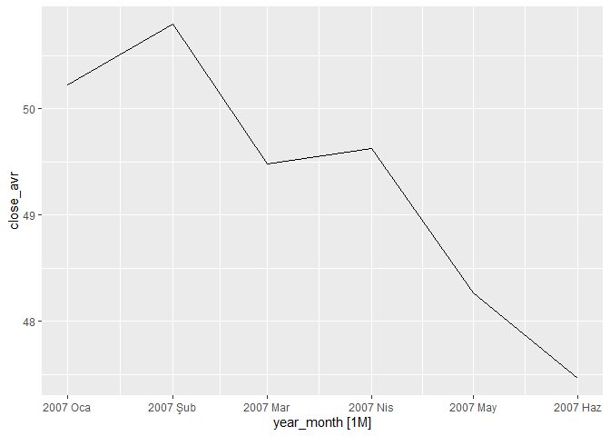

<style type="text/css"> 
body{
  font-size: 12pt;
}
code.r{
  font-size: 12pt;
}
</style>


# Handling Time Series Data in R 

A time series is a set of temporally ordered (indexed) measurements or observations. Most time series are recorded at regular intervals of time (hourly, half-daily, daily, weekly, monthly, quarterly, yearly, etc.). But we should note that irregular times series and missing values are also possible. 

Time series data sets are typically used in macroeconomic and financial applications. Forecasting future values based on the past information is also a standard problem encountered in practice. For example, the central bank routinely forecasts inflation rate in the upcoming months. 

In order to develop and estimate empirical econometric models  using time series data, we need to handle the data in a specialized way. A software package, `R` for example, does not know the type of data. Users need to tell `R` that observations are indexed by time (usually discretely) and the operations on values must respect the temporal order. 

There are several ways of representing time series data in `R`. Some of the most widely used object classes are summarized below. More information can be found at [CRAN Task View: Time Series Analysis](https://cran.r-project.org/web/views/TimeSeries.html)

## `ts` object

`ts` is one of the fundamental classes in base `R`. `ts` can represent regularly spaced time series data (yearly, monthly, quarterly, etc.) using numerical time stamps. As an example consider

```r
set.seed(1)
x <- rnorm(10)
x
```

```
##  [1] -0.6264538  0.1836433 -0.8356286  1.5952808  0.3295078 -0.8204684
##  [7]  0.4874291  0.7383247  0.5757814 -0.3053884
```

```r
class(x)
```

```
## [1] "numeric"
```
The class of random variable `x` is numeric. Let us create a `ts` object that assigns years from 2010 to 2019 as time stamps: 


```r
ts_annual <- ts(x, start = 2010, frequency = 1)
ts_annual
```

```
## Time Series:
## Start = 2010 
## End = 2019 
## Frequency = 1 
##  [1] -0.6264538  0.1836433 -0.8356286  1.5952808  0.3295078 -0.8204684
##  [7]  0.4874291  0.7383247  0.5757814 -0.3053884
```

Note that newly created data `tsx` is still numeric with additional attributes indicating the start, end and the frequency of the data points. 


```r
class(ts_annual)
```

```
## [1] "ts"
```

```r
attributes(ts_annual)
```

```
## $tsp
## [1] 2010 2019    1
## 
## $class
## [1] "ts"
```
The class of `ts_annual` vector is `ts`. The `tsp` attribute shows the start, end, and the frequency of the time series (1 means yearly data). 

The base `R`'s `plot` function recognizes the class and draws the appropriate time series graph: 

```r
plot(ts_annual)
```

<!-- -->

Note that if we use the `plot` function in the same for the numeric vector `x` we obtain: 

```r
plot(x)
```

<!-- -->

For a collection of time series we have a numeric matrix with time attributes. 
As an example, consider the simulated data set: 

```r
set.seed(22)
n <- 120
x1 <- rnorm(n)
x2 <- rnorm(n)
t <- 1:n
y <- 10 + 0.1*t + 2*x1 - 3*x2 + rnorm(n)
df1 <- data.frame(y, x1, x2)
head(df1)
```

```
##          y         x1         x2
## 1 11.01752 -0.5121391 -0.6665832
## 2 17.13793  2.4851837 -0.3467479
## 3 14.11995  1.0078262 -0.4358330
## 4 16.11770  0.2928146 -1.9470039
## 5 11.83468 -0.2089594 -0.8379082
## 6 17.89354  1.8580924 -0.7415289
```

Let's assume that this is a set of monthly realizations over a 10 year period starting 2010m1: 

```r
ts_monthly <- ts(df1, start = c(2010, 1), end = c(2019, 12), frequency = 12)
head(ts_monthly)
```

```
##             y         x1         x2
## [1,] 11.01752 -0.5121391 -0.6665832
## [2,] 17.13793  2.4851837 -0.3467479
## [3,] 14.11995  1.0078262 -0.4358330
## [4,] 16.11770  0.2928146 -1.9470039
## [5,] 11.83468 -0.2089594 -0.8379082
## [6,] 17.89354  1.8580924 -0.7415289
```

```r
attributes(ts_monthly)
```

```
## $dim
## [1] 120   3
## 
## $dimnames
## $dimnames[[1]]
## NULL
## 
## $dimnames[[2]]
## [1] "y"  "x1" "x2"
## 
## 
## $tsp
## [1] 2010.000 2019.917   12.000
## 
## $class
## [1] "mts"    "ts"     "matrix"
```


```r
class(ts_monthly)
```

```
## [1] "mts"    "ts"     "matrix"
```


```r
plot(ts_monthly)
```

<!-- -->


Similarly, a quarterly `ts` object can be created using

```r
ts_quarterly <- ts(runif(8), start = c(2018, 1), frequency = 4)
ts_quarterly
```

```
##           Qtr1      Qtr2      Qtr3      Qtr4
## 2018 0.7304693 0.7870054 0.8954003 0.3331258
## 2019 0.8876747 0.6141378 0.7607281 0.5440350
```

A subset of observations can be created using the `window` function. For example, usig the `ts_monthly` data set, create another `ts` object from 2018m1 to the end:  

```r
ts_monthly_subset <- window(ts_monthly, start=c(2018,1))
ts_monthly_subset
```

```
##                 y          x1          x2
## Jan 2018 18.40797 -0.33324995  0.10869187
## Feb 2018 15.74612 -0.39793547  1.45290569
## Mar 2018 19.74570 -0.50115035 -0.61267109
## Apr 2018 18.01528 -0.77273822 -0.06516846
## May 2018 15.36078 -1.71239612  0.26570978
## Jun 2018 17.60987 -0.79921870 -0.01060245
## Jul 2018 16.49052 -1.41085475  0.33320645
## Aug 2018 23.21067  0.53275820 -0.79305213
## Sep 2018 24.64894 -0.39770077 -1.19191589
## Oct 2018 19.28710 -0.28435325  0.69395132
## Nov 2018 24.51503  0.12498413 -1.19316828
## Dec 2018 27.16400  0.78012669 -1.41040845
## Jan 2019 19.16921 -0.87559719  0.40811576
## Feb 2019 15.56407 -1.15936503  1.04478745
## Mar 2019 19.88641 -0.14586878  0.39343983
## Apr 2019 17.44377 -1.67842869  0.48269703
## May 2019 19.31902 -1.32258464  0.02858935
## Jun 2019 18.43350 -0.55887740  0.41441915
## Jul 2019 18.84263 -2.48978148 -0.61271368
## Aug 2019 22.35360  1.17918927  0.76866790
## Sep 2019 23.95577  0.79370484 -0.31469479
## Oct 2019 23.80681  1.60743480  0.37070328
## Nov 2019 27.92537  0.06594797 -1.93087451
## Dec 2019 20.57888  1.02900536  0.79631138
```


## `zoo` object

One of the drawback of `ts` class is that the time stamp can only be numeric. Although this may be fine for monthly, quarterly, and annual data, more general time indexes, such as irregularly spaced hourly or daily data, may be difficult to handle. Also, if there are missing values in the data, specifying start, end, and the frequency may not be sufficient to define to time series. 

There are several alternatives to `ts` class. The package `zoo` (and the associated `zoo` class) is suggested by [Zeileis and Grothendieck (2005)](http://dx.doi.org/10.18637/jss.v014.i06). Also see the CRAN page: [zoo: S3 Infrastructure for Regular and Irregular Time Series (Z's Ordered Observations)](https://cran.r-project.org/web/packages/zoo/index.html). 


```r
library(zoo)
```

```
## 
## Attaching package: 'zoo'
```

```
## The following objects are masked from 'package:base':
## 
##     as.Date, as.Date.numeric
```

```r
n <- 10
dates <- seq(as.Date("2020-12-01"), length = n, by = "days")
dates
```

```
##  [1] "2020-12-01" "2020-12-02" "2020-12-03" "2020-12-04" "2020-12-05"
##  [6] "2020-12-06" "2020-12-07" "2020-12-08" "2020-12-09" "2020-12-10"
```

```r
x_zoo <- zoo(x = rnorm(n), order.by = dates)
x_zoo
```

```
##  2020-12-01  2020-12-02  2020-12-03  2020-12-04  2020-12-05  2020-12-06 
##  0.82822485 -0.27596111  0.90011072  0.40052611 -2.43993993  1.70488277 
##  2020-12-07  2020-12-08  2020-12-09  2020-12-10 
## -0.35356859 -0.40279204 -0.01563910  0.04372756
```


```r
class(x_zoo)
```

```
## [1] "zoo"
```


```r
plot(x_zoo)
```

<!-- -->


A `ts` can be converted into a `zoo` object using `as.zoo` function. The reverse is possible using `as.ts` function. 


```r
zoo_monthly <- as.zoo(ts_monthly)
plot(zoo_monthly)
```

<!-- -->

As another example let's plot the built-in data `AirPassengers` using `zoo` package: 

```r
plot(autoplot.zoo(as.zoo(AirPassengers)))
```

<!-- -->


## `xts` object

`xts` or Extensible Time Series object extends the capabilities of a `zoo` object. `xts` can handle POSIXct and Date classes to represent time. For more information visit CRAN page: [xts: eXtensible Time Series](https://cran.r-project.org/web/packages/xts/index.html). 


```r
library(xts)
xts_data1 <- xts(x = runif(5), order.by=Sys.Date()-1:5) 
colnames(xts_data1) <- "var1"
xts_data1
```

```
##                 var1
## 2021-02-08 0.5986281
## 2021-02-09 0.4638573
## 2021-02-10 0.6464816
## 2021-02-11 0.7256413
## 2021-02-12 0.2013998
```


```r
# sunspots data
data("sunspots")
xts_sunspots <- as.xts(sunspots)
head(xts_sunspots)
```

```
##          [,1]
## Oca 1749 58.0
## Şub 1749 62.6
## Mar 1749 70.0
## Nis 1749 55.7
## May 1749 85.0
## Haz 1749 83.5
```


```r
class(xts_sunspots)
```

```
## [1] "xts" "zoo"
```

```r
periodicity(xts_sunspots)
```

```
## Monthly periodicity from Oca 1749 to Ara 1983
```


```r
plot(xts_sunspots)
```

<!-- -->

Here is an example of daily data: 

```r
data("sample_matrix")
xts_daily <- as.xts(sample_matrix)
head(xts_daily)
```

```
##                Open     High      Low    Close
## 2007-01-02 50.03978 50.11778 49.95041 50.11778
## 2007-01-03 50.23050 50.42188 50.23050 50.39767
## 2007-01-04 50.42096 50.42096 50.26414 50.33236
## 2007-01-05 50.37347 50.37347 50.22103 50.33459
## 2007-01-06 50.24433 50.24433 50.11121 50.18112
## 2007-01-07 50.13211 50.21561 49.99185 49.99185
```


```r
plot(xts_daily)
```

<!-- -->


## `tsibble` object

A more recent alternative is to use the framework provided by the meta package `tidyverts` designed by R. Hyndman and his friends. [tidyverts](https://tidyverts.org/) consists of four packages: `tsibble`, `fable`, `feasts`, and `tsibbledata.` It is designed to work closely with `tidyverse` collection of packages. It follows the tidy data approach and easily integrates with the functions in [tidyverse](https://www.tidyverse.org/). 

More information on `tsibble` object can be found at [tsibble: Tidy Temporal Data Frames and Tools](https://cran.r-project.org/web/packages/tsibble/index.html). Also, the book [Hyndman, R.J., & Athanasopoulos, G. (2019) Forecasting: principles and practice, 3rd edition, OTexts: Melbourne, Australia.](https://otexts.com/fpp3/) uses the `tidyverts` framework. 


We can easily create a `tsibble` object using 

```r
library(tsibble)
```

```
## 
## Attaching package: 'tsibble'
```

```
## The following object is masked from 'package:zoo':
## 
##     index
```

```r
tsdata1 <- tsibble(year = 2017:2019, 
                   var1 = c(100, 90, 105), 
                   index = year)
tsdata1
```

```
## # A tsibble: 3 x 2 [1Y]
##    year  var1
##   <int> <dbl>
## 1  2017   100
## 2  2018    90
## 3  2019   105
```

A `tsibble` object always has a an index to represent time (and an optional key or keys). In the simple example above, time index is year. 


As another example, consider the following data where have two-year observations on GDP per capita (TL in nominal terms) in three provinces Istanbul, Ankara and Izmir. In this example time index is year and key variable is province. The key variable must be provided in this example because there are multiple measurements on the same time index (that is, year). This is a minimal example of a panel (or longitudinal) data set.  

```r
tsdata2 <- tsibble(year = c(rep(2017,3), rep(2018,3)), 
                   province = rep(c("Istanbul", "Ankara", "Izmir"),2), 
                   GDPpc = c(65195,51922,45102,76769,60249,54305), 
                   index = year, 
                   key = province
                   )
tsdata2
```

```
## # A tsibble: 6 x 3 [1Y]
## # Key:       province [3]
##    year province GDPpc
##   <dbl> <chr>    <dbl>
## 1  2017 Ankara   51922
## 2  2018 Ankara   60249
## 3  2017 Istanbul 65195
## 4  2018 Istanbul 76769
## 5  2017 Izmir    45102
## 6  2018 Izmir    54305
```


```r
index(tsdata2)
```

```
## year
```


```r
key(tsdata2)
```

```
## [[1]]
## province
```

As a more complicated example, here is a cross-country panel data set from `tsibbledata` package: 


```r
library(tsibbledata)
```

```
## Warning: package 'tsibbledata' was built under R version 3.6.3
```

```r
data("global_economy")
global_economy
```

```
## # A tsibble: 15,150 x 9 [1Y]
## # Key:       Country [263]
##    Country     Code   Year         GDP Growth   CPI Imports Exports Population
##    <fct>       <fct> <dbl>       <dbl>  <dbl> <dbl>   <dbl>   <dbl>      <dbl>
##  1 Afghanistan AFG    1960  537777811.     NA    NA    7.02    4.13    8996351
##  2 Afghanistan AFG    1961  548888896.     NA    NA    8.10    4.45    9166764
##  3 Afghanistan AFG    1962  546666678.     NA    NA    9.35    4.88    9345868
##  4 Afghanistan AFG    1963  751111191.     NA    NA   16.9     9.17    9533954
##  5 Afghanistan AFG    1964  800000044.     NA    NA   18.1     8.89    9731361
##  6 Afghanistan AFG    1965 1006666638.     NA    NA   21.4    11.3     9938414
##  7 Afghanistan AFG    1966 1399999967.     NA    NA   18.6     8.57   10152331
##  8 Afghanistan AFG    1967 1673333418.     NA    NA   14.2     6.77   10372630
##  9 Afghanistan AFG    1968 1373333367.     NA    NA   15.2     8.90   10604346
## 10 Afghanistan AFG    1969 1408888922.     NA    NA   15.0    10.1    10854428
## # ... with 15,140 more rows
```

In the `global_economy` data set, the time index is `Year` and key is `Country`. 

Commonly employed time formats and associated functions  are summarized in the table below: (Source: [Hyndman and Athanasopoulos (2019) Forecasting: principles and practice, 3rd edition](https://otexts.com/fpp3/))

| **Interval** | **Class**                 |**Function**               |
|--------------|---------------------------|---------------------------|
| Annual       | `integer`/`double`        | `start:end`               |
| Quarterly    | `yearquarter`             | `yearquarter()`           |
| Monthly      | `yearmonth`               | `yearmonth()`             |
| Weekly       | `yearweek`                | `yearweek()`              |
| Daily        | `Date`/`difftime`         | `as_date()`, `ymd()`      |
| Subdaily     | `POSIXt`/`difftime`/`hms` | `as_datetime()`           |
|                                                                      |


An existing time series object can be converted into a `tsibble` object.  

```r
library(tsibble)
library(tidyverse)
library(lubridate)
library(xts)
library(fpp3)
# use built-in daily data on closing prices from xts package
data("sample_matrix")
head(sample_matrix)
```

```
##                Open     High      Low    Close
## 2007-01-02 50.03978 50.11778 49.95041 50.11778
## 2007-01-03 50.23050 50.42188 50.23050 50.39767
## 2007-01-04 50.42096 50.42096 50.26414 50.33236
## 2007-01-05 50.37347 50.37347 50.22103 50.33459
## 2007-01-06 50.24433 50.24433 50.11121 50.18112
## 2007-01-07 50.13211 50.21561 49.99185 49.99185
```


```r
# convert sample_matrix into tibble and create a date variable
df1 <- tibble(date = rownames(sample_matrix), 
              close = sample_matrix[,4]
              )
df1 <- df1 %>% 
  mutate(date = lubridate::ymd(date))
df1
```

```
## # A tibble: 180 x 2
##    date       close
##    <date>     <dbl>
##  1 2007-01-02  50.1
##  2 2007-01-03  50.4
##  3 2007-01-04  50.3
##  4 2007-01-05  50.3
##  5 2007-01-06  50.2
##  6 2007-01-07  50.0
##  7 2007-01-08  50.0
##  8 2007-01-09  49.9
##  9 2007-01-10  50.0
## 10 2007-01-11  50.2
## # ... with 170 more rows
```


```r
tsibble_daily <- as_tsibble(df1, index = date)
tsibble_daily
```

```
## # A tsibble: 180 x 2 [1D]
##    date       close
##    <date>     <dbl>
##  1 2007-01-02  50.1
##  2 2007-01-03  50.4
##  3 2007-01-04  50.3
##  4 2007-01-05  50.3
##  5 2007-01-06  50.2
##  6 2007-01-07  50.0
##  7 2007-01-08  50.0
##  8 2007-01-09  49.9
##  9 2007-01-10  50.0
## 10 2007-01-11  50.2
## # ... with 170 more rows
```

We can create a new data set by averaging closing prices within a month. Let's first create a new variable `year_month` using the `tsibble::yearmonth()` function. This will be used as a grouping variable and index variable in the new data set. 

```r
tsibble_monthly <- tsibble_daily %>% 
  mutate(year_month = yearmonth(date))
tsibble_monthly
```

```
## # A tsibble: 180 x 3 [1D]
##    date       close year_month
##    <date>     <dbl>      <mth>
##  1 2007-01-02  50.1   2007 Oca
##  2 2007-01-03  50.4   2007 Oca
##  3 2007-01-04  50.3   2007 Oca
##  4 2007-01-05  50.3   2007 Oca
##  5 2007-01-06  50.2   2007 Oca
##  6 2007-01-07  50.0   2007 Oca
##  7 2007-01-08  50.0   2007 Oca
##  8 2007-01-09  49.9   2007 Oca
##  9 2007-01-10  50.0   2007 Oca
## 10 2007-01-11  50.2   2007 Oca
## # ... with 170 more rows
```

The data set `tsibble_monthly` still has `date` as the time index. Note that 
the variable `year_month` repeats the same values within the same year-month combination, as expected. Using `index_by()` function, we can compute summary statistics by grouping on the time index (this is similar to `group_by()` in `dplyr` package). 


```r
tsibble_monthly2 <- tsibble_monthly %>% 
  index_by(year_month) %>% 
  summarize(close_avr = mean(close), 
            count = n())
tsibble_monthly2
```

```
## # A tsibble: 6 x 3 [1M]
##   year_month close_avr count
##        <mth>     <dbl> <int>
## 1   2007 Oca      50.2    30
## 2   2007 Şub      50.8    28
## 3   2007 Mar      49.5    31
## 4   2007 Nis      49.6    30
## 5   2007 May      48.3    31
## 6   2007 Haz      47.5    30
```

Graph of daily data: 

```r
tsibble_daily %>% autoplot(close)
```

<!-- -->

```r
tsibble_monthly2 %>% autoplot(close_avr)
```

<!-- -->


<br>
<div class="tocify-extend-page" data-unique="tocify-extend-page" style="height: 0;"></div>
