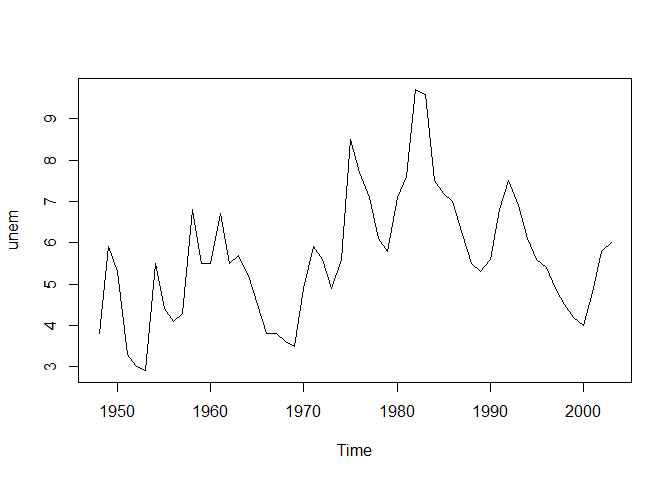

<style type="text/css"> 
body{
  font-size: 12pt;
}
code.r{
  font-size: 12pt;
}
</style>


# Replicating Examples in ch.10 of Wooldridge's Text (6th ed) 

## Example 10.1: Static Phillips Curve


```r
# Install packages
library(wooldridge)
library(dynlm)
library(lmtest)
library(car)
```

We first need to define a time series (ts) object in R. 

```r
# create a ts object 
inf <- ts(phillips$inf, start=1948, frequency = 1)
unem <- ts(phillips$unem, start=1948, frequency = 1)
# all variables in the data set: 
tsphillips <- ts(phillips, start=1948, frequency = 1)
tsphillips
```

```
## Time Series:
## Start = 1948 
## End = 2003 
## Frequency = 1 
##      year unem  inf inf_1 unem_1       cinf       cunem
## 1948 1948  3.8  8.1    NA     NA         NA          NA
## 1949 1949  5.9 -1.2   8.1    3.8 -9.3000002  2.10000014
## 1950 1950  5.3  1.3  -1.2    5.9  2.5000000 -0.59999990
## 1951 1951  3.3  7.9   1.3    5.3  6.6000004 -2.00000024
## 1952 1952  3.0  1.9   7.9    3.3 -6.0000000 -0.29999995
## 1953 1953  2.9  0.8   1.9    3.0 -1.0999999 -0.09999990
## 1954 1954  5.5  0.7   0.8    2.9 -0.1000000  2.59999990
## 1955 1955  4.4 -0.4   0.7    5.5 -1.1000000 -1.09999990
## 1956 1956  4.1  1.5  -0.4    4.4  1.9000000 -0.30000019
## 1957 1957  4.3  3.3   1.5    4.1  1.8000000  0.20000029
## 1958 1958  6.8  2.8   3.3    4.3 -0.5000000  2.50000000
## 1959 1959  5.5  0.7   2.8    6.8 -2.0999999 -1.30000019
## 1960 1960  5.5  1.7   0.7    5.5  1.0000000  0.00000000
## 1961 1961  6.7  1.0   1.7    5.5 -0.7000000  1.19999981
## 1962 1962  5.5  1.0   1.0    6.7  0.0000000 -1.19999981
## 1963 1963  5.7  1.3   1.0    5.5  0.3000000  0.19999981
## 1964 1964  5.2  1.3   1.3    5.7  0.0000000 -0.50000000
## 1965 1965  4.5  1.6   1.3    5.2  0.3000001 -0.69999981
## 1966 1966  3.8  2.9   1.6    4.5  1.3000001 -0.70000005
## 1967 1967  3.8  3.1   2.9    3.8  0.1999998  0.00000000
## 1968 1968  3.6  4.2   3.1    3.8  1.0999999 -0.20000005
## 1969 1969  3.5  5.5   4.2    3.6  1.3000002 -0.09999990
## 1970 1970  4.9  5.7   5.5    3.5  0.1999998  1.40000010
## 1971 1971  5.9  4.4   5.7    4.9 -1.2999997  1.00000000
## 1972 1972  5.6  3.2   4.4    5.9 -1.2000000 -0.30000019
## 1973 1973  4.9  6.2   3.2    5.6  2.9999998 -0.69999981
## 1974 1974  5.6 11.0   6.2    4.9  4.8000002  0.69999981
## 1975 1975  8.5  9.1  11.0    5.6 -1.8999996  2.90000010
## 1976 1976  7.7  5.8   9.1    8.5 -3.3000002 -0.80000019
## 1977 1977  7.1  6.5   5.8    7.7  0.6999998 -0.59999990
## 1978 1978  6.1  7.6   6.5    7.1  1.0999999 -1.00000000
## 1979 1979  5.8 11.3   7.6    6.1  3.7000003 -0.29999971
## 1980 1980  7.1 13.5  11.3    5.8  2.1999998  1.29999971
## 1981 1981  7.6 10.3  13.5    7.1 -3.1999998  0.50000000
## 1982 1982  9.7  6.2  10.3    7.6 -4.1000004  2.09999990
## 1983 1983  9.6  3.2   6.2    9.7 -2.9999998 -0.09999943
## 1984 1984  7.5  4.3   3.2    9.6  1.1000001 -2.10000038
## 1985 1985  7.2  3.6   4.3    7.5 -0.7000003 -0.30000019
## 1986 1986  7.0  1.9   3.6    7.2 -1.6999999 -0.19999981
## 1987 1987  6.2  3.6   1.9    7.0  1.6999999 -0.80000019
## 1988 1988  5.5  4.1   3.6    6.2  0.5000000 -0.69999981
## 1989 1989  5.3  4.8   4.1    5.5  0.7000003 -0.19999981
## 1990 1990  5.6  5.4   4.8    5.3  0.5999999  0.29999971
## 1991 1991  6.8  4.2   5.4    5.6 -1.2000003  1.20000029
## 1992 1992  7.5  3.0   4.2    6.8 -1.1999998  0.69999981
## 1993 1993  6.9  3.0   3.0    7.5  0.0000000 -0.59999990
## 1994 1994  6.1  2.6   3.0    6.9 -0.4000001 -0.80000019
## 1995 1995  5.6  2.8   2.6    6.1  0.2000000 -0.50000000
## 1996 1996  5.4  3.0   2.8    5.6  0.2000000 -0.19999981
## 1997 1997  4.9  2.3   3.0    5.4 -0.7000000 -0.50000000
## 1998 1998  4.5  1.6   2.3    4.9 -0.6999999 -0.40000010
## 1999 1999  4.2  2.2   1.6    4.5  0.6000000 -0.30000019
## 2000 2000  4.0  3.4   2.2    4.2  1.2000000 -0.19999981
## 2001 2001  4.8  2.8   3.4    4.0 -0.6000001  0.80000019
## 2002 2002  5.8  1.6   2.8    4.8 -1.1999999  1.00000000
## 2003 2003  6.0  2.3   1.6    5.8  0.6999999  0.19999981
```

### Time series plots

Using the base R plot function, we have 

```r
plot(unem)
```

<!-- -->

```r
plot(inf)
```

<!-- -->

```r
# ts.plot(tsphillips[,2:3])

ts.plot(unem,inf, col = c("black", "red"), lty=1:2, xlab="")
legend("topleft", bty="n", lty=1:2, col=c("black","red"),
       legend=c(" unem ", " inf "))
```

<!-- -->

Altarnatively, we can use `ggplot()` as follows

```r
library(ggplot2)
ggplot(data = phillips, aes(year,inf)) + 
  geom_line() + 
  ylab("Inflation") + 
  xlab("Year")
```

<!-- -->


Both inflation and unemployment on the same graph: 

```r
ggplot(data = phillips) +
  geom_line(aes(year, inf, color="inflation")) + 
  geom_line(aes(year, unem, color="unemployment")) +
  labs(color="") + 
  ylab("")
```

<!-- -->

Here is another way which uses `forecast::autoplot()` function: 

```r
library(forecast)
library(ggplot2)
autoplot(inf, series = "inflation") + 
  autolayer(unem, series = "unemployment") +
  xlab("") + ylab("") + 
  ggtitle("Inflation and Unemployment Rate: 1948-2003")
```

<!-- -->


### Static regression


```r
# using lm function
res <- lm(inf ~ unem, data = phillips)
summary(res)
```

```
## 
## Call:
## lm(formula = inf ~ unem, data = phillips)
## 
## Residuals:
##     Min      1Q  Median      3Q     Max 
## -5.2176 -1.7812 -0.6659  1.1473  8.8795 
## 
## Coefficients:
##             Estimate Std. Error t value Pr(>|t|)  
## (Intercept)   1.0536     1.5480   0.681   0.4990  
## unem          0.5024     0.2656   1.892   0.0639 .
## ---
## Signif. codes:  0 '***' 0.001 '**' 0.01 '*' 0.05 '.' 0.1 ' ' 1
## 
## Residual standard error: 2.972 on 54 degrees of freedom
## Multiple R-squared:  0.06215,	Adjusted R-squared:  0.04479 
## F-statistic: 3.579 on 1 and 54 DF,  p-value: 0.06389
```


```r
# or using dynlm package 
res1 <- dynlm(inf ~ unem, data  = tsphillips)
summary(res1)
```

```
## 
## Time series regression with "ts" data:
## Start = 1948, End = 2003
## 
## Call:
## dynlm(formula = inf ~ unem, data = tsphillips)
## 
## Residuals:
##     Min      1Q  Median      3Q     Max 
## -5.2176 -1.7812 -0.6659  1.1473  8.8795 
## 
## Coefficients:
##             Estimate Std. Error t value Pr(>|t|)  
## (Intercept)   1.0536     1.5480   0.681   0.4990  
## unem          0.5024     0.2656   1.892   0.0639 .
## ---
## Signif. codes:  0 '***' 0.001 '**' 0.01 '*' 0.05 '.' 0.1 ' ' 1
## 
## Residual standard error: 2.972 on 54 degrees of freedom
## Multiple R-squared:  0.06215,	Adjusted R-squared:  0.04479 
## F-statistic: 3.579 on 1 and 54 DF,  p-value: 0.06389
```

The results suggest that inflation and unemployment move in the same direction, contradicting the Phillips curve theory (but we will see that there are several problems with regressions like this). 

## Example 10.2: Effects of Inflation and Deficits on Interest Rates


```r
# create a ts object 
i3 <- ts(intdef$i3, start=1948, frequency = 1)
inf <- ts(intdef$inf, start=1948, frequency = 1)
# plot
ts.plot(i3,inf, col = c("black", "red"), lty=1:2, xlab="")
legend("topleft", bty="n", lty=1:2, col=c("black","red"),
       legend=c(" i3 ", " inf "))
```

<!-- -->


```r
ggplot(data = intdef) +  
  geom_line(aes(year, i3, color="i3")) + 
  geom_line(aes(year, inf, color="inf")) + 
  labs(color="") +
  ylab("") +
  theme_bw()
```

<!-- -->


```r
tsintdata <- ts(intdef, start = 1948, frequency = 1)
i3_inf <- ts(tsintdata[,2:3], 
             start = 1948, frequency = 1)
head(i3_inf)
```

```
## Time Series:
## Start = 1948 
## End = 1953 
## Frequency = 1 
##        i3  inf
## 1948 1.04  8.1
## 1949 1.10 -1.2
## 1950 1.22  1.3
## 1951 1.55  7.9
## 1952 1.77  1.9
## 1953 1.93  0.8
```

Using `ggfortify` package, plot inf and i3 together: 

```r
library(ggfortify)
autoplot(i3_inf)
```

<!-- -->


```r
# static model:
intmodel1 <- lm(i3 ~ inf + def, data = intdef)
summary(intmodel1)
```

```
## 
## Call:
## lm(formula = i3 ~ inf + def, data = intdef)
## 
## Residuals:
##     Min      1Q  Median      3Q     Max 
## -3.9948 -1.1694  0.1959  0.9602  4.7224 
## 
## Coefficients:
##             Estimate Std. Error t value Pr(>|t|)    
## (Intercept)  1.73327    0.43197   4.012  0.00019 ***
## inf          0.60587    0.08213   7.376 1.12e-09 ***
## def          0.51306    0.11838   4.334 6.57e-05 ***
## ---
## Signif. codes:  0 '***' 0.001 '**' 0.01 '*' 0.05 '.' 0.1 ' ' 1
## 
## Residual standard error: 1.843 on 53 degrees of freedom
## Multiple R-squared:  0.6021,	Adjusted R-squared:  0.5871 
## F-statistic: 40.09 on 2 and 53 DF,  p-value: 2.483e-11
```


```r
# static model using dynlm package 
intmodel2 <- dynlm(i3 ~ inf + def, data  = tsintdata)
summary(intmodel2)
```

```
## 
## Time series regression with "ts" data:
## Start = 1948, End = 2003
## 
## Call:
## dynlm(formula = i3 ~ inf + def, data = tsintdata)
## 
## Residuals:
##     Min      1Q  Median      3Q     Max 
## -3.9948 -1.1694  0.1959  0.9602  4.7224 
## 
## Coefficients:
##             Estimate Std. Error t value Pr(>|t|)    
## (Intercept)  1.73327    0.43197   4.012  0.00019 ***
## inf          0.60587    0.08213   7.376 1.12e-09 ***
## def          0.51306    0.11838   4.334 6.57e-05 ***
## ---
## Signif. codes:  0 '***' 0.001 '**' 0.01 '*' 0.05 '.' 0.1 ' ' 1
## 
## Residual standard error: 1.843 on 53 degrees of freedom
## Multiple R-squared:  0.6021,	Adjusted R-squared:  0.5871 
## F-statistic: 40.09 on 2 and 53 DF,  p-value: 2.483e-11
```


## Example 10.3: Puerto Rican Employment and the Minimum Wage


```r
minwage <- lm(lprepop ~ lmincov + lusgnp, data = prminwge)
summary(minwage)
```

```
## 
## Call:
## lm(formula = lprepop ~ lmincov + lusgnp, data = prminwge)
## 
## Residuals:
##       Min        1Q    Median        3Q       Max 
## -0.117133 -0.036998 -0.005943  0.028182  0.113938 
## 
## Coefficients:
##             Estimate Std. Error t value Pr(>|t|)  
## (Intercept) -1.05442    0.76541  -1.378   0.1771  
## lmincov     -0.15444    0.06490  -2.380   0.0229 *
## lusgnp      -0.01219    0.08851  -0.138   0.8913  
## ---
## Signif. codes:  0 '***' 0.001 '**' 0.01 '*' 0.05 '.' 0.1 ' ' 1
## 
## Residual standard error: 0.0557 on 35 degrees of freedom
## Multiple R-squared:  0.6605,	Adjusted R-squared:  0.6411 
## F-statistic: 34.04 on 2 and 35 DF,  p-value: 6.17e-09
```

## Example 10.4: Effects of Personal Exemption on Fertility Rates


```r
data(fertil3, package='wooldridge')
tsfertil <- ts(fertil3, start=1913)

# graphs
ts.plot(tsfertil[,1:2], col = c("black", "red"), lty=1:2, xlab="")
legend("topleft", bty="n", lty=1:2, col=c("black","red"),
       legend=c(" gfr ", " pr "))
```

<!-- -->


```r
# Static model 
staticres <- dynlm(gfr ~ pe +  ww2 + pill, data = tsfertil)
summary(staticres)
```

```
## 
## Time series regression with "ts" data:
## Start = 1913, End = 1984
## 
## Call:
## dynlm(formula = gfr ~ pe + ww2 + pill, data = tsfertil)
## 
## Residuals:
##      Min       1Q   Median       3Q      Max 
## -27.0187  -9.6195   0.3393   9.4746  28.0730 
## 
## Coefficients:
##              Estimate Std. Error t value Pr(>|t|)    
## (Intercept)  98.68176    3.20813  30.760  < 2e-16 ***
## pe            0.08254    0.02965   2.784  0.00694 ** 
## ww2         -24.23840    7.45825  -3.250  0.00180 ** 
## pill        -31.59403    4.08107  -7.742 6.46e-11 ***
## ---
## Signif. codes:  0 '***' 0.001 '**' 0.01 '*' 0.05 '.' 0.1 ' ' 1
## 
## Residual standard error: 14.69 on 68 degrees of freedom
## Multiple R-squared:  0.4734,	Adjusted R-squared:  0.4502 
## F-statistic: 20.38 on 3 and 68 DF,  p-value: 1.575e-09
```


```r
# Dynamic model using dynlm package
# Note: L(pe) is the first lag of pe, L(pe,2) is the second lag
dynres <- dynlm(gfr ~ pe + L(pe) + L(pe,2) + ww2 + pill, data = tsfertil)
summary(dynres)
```

```
## 
## Time series regression with "ts" data:
## Start = 1915, End = 1984
## 
## Call:
## dynlm(formula = gfr ~ pe + L(pe) + L(pe, 2) + ww2 + pill, data = tsfertil)
## 
## Residuals:
##      Min       1Q   Median       3Q      Max 
## -24.6461  -9.5409  -0.0312   8.3378  29.1295 
## 
## Coefficients:
##              Estimate Std. Error t value Pr(>|t|)    
## (Intercept)  95.87050    3.28196  29.211  < 2e-16 ***
## pe            0.07267    0.12553   0.579   0.5647    
## L(pe)        -0.00578    0.15566  -0.037   0.9705    
## L(pe, 2)      0.03383    0.12626   0.268   0.7896    
## ww2         -22.12650   10.73197  -2.062   0.0433 *  
## pill        -31.30499    3.98156  -7.862 5.63e-11 ***
## ---
## Signif. codes:  0 '***' 0.001 '**' 0.01 '*' 0.05 '.' 0.1 ' ' 1
## 
## Residual standard error: 14.27 on 64 degrees of freedom
## Multiple R-squared:  0.4986,	Adjusted R-squared:  0.4594 
## F-statistic: 12.73 on 5 and 64 DF,  p-value: 1.353e-08
```

```r
coeftest(dynres)
```

```
## 
## t test of coefficients:
## 
##                Estimate  Std. Error t value  Pr(>|t|)    
## (Intercept)  95.8704975   3.2819571 29.2114 < 2.2e-16 ***
## pe            0.0726718   0.1255331  0.5789    0.5647    
## L(pe)        -0.0057796   0.1556629 -0.0371    0.9705    
## L(pe, 2)      0.0338268   0.1262574  0.2679    0.7896    
## ww2         -22.1264975  10.7319716 -2.0617    0.0433 *  
## pill        -31.3049888   3.9815591 -7.8625 5.634e-11 ***
## ---
## Signif. codes:  0 '***' 0.001 '**' 0.01 '*' 0.05 '.' 0.1 ' ' 1
```


```r
# F test. H0: all pe coefficients are=0
linearHypothesis(dynres, matchCoefs(dynres,"pe"))
```

```
## Linear hypothesis test
## 
## Hypothesis:
## pe = 0
## L(pe) = 0
## L(pe, 2) = 0
## 
## Model 1: restricted model
## Model 2: gfr ~ pe + L(pe) + L(pe, 2) + ww2 + pill
## 
##   Res.Df   RSS Df Sum of Sq     F  Pr(>F)  
## 1     67 15460                             
## 2     64 13033  3    2427.1 3.973 0.01165 *
## ---
## Signif. codes:  0 '***' 0.001 '**' 0.01 '*' 0.05 '.' 0.1 ' ' 1
```

```r
# Calculating the LRP
b <- coef(dynres)
b["pe"]+b["L(pe)"]+b["L(pe, 2)"]
```

```
##        pe 
## 0.1007191
```


```r
# F test. H0: LRP=0
linearHypothesis(dynres,"pe + L(pe) + L(pe, 2) = 0")
```

```
## Linear hypothesis test
## 
## Hypothesis:
## pe  + L(pe)  + L(pe, 2) = 0
## 
## Model 1: restricted model
## Model 2: gfr ~ pe + L(pe) + L(pe, 2) + ww2 + pill
## 
##   Res.Df   RSS Df Sum of Sq      F   Pr(>F)   
## 1     65 15358                                
## 2     64 13033  1    2325.8 11.421 0.001241 **
## ---
## Signif. codes:  0 '***' 0.001 '**' 0.01 '*' 0.05 '.' 0.1 ' ' 1
```

 
## Example 10.5: Antidumping Filings and Chemical Imports


```r
impts <- ts(barium$chnimp, start=c(1978,2), frequency=12)

# plot time series
plot(impts)
```

<!-- -->


```r
# Static model 
bariumres <- dynlm(log(chnimp) ~ log(chempi) + log(gas) + log(rtwex) + 
                     befile6 + affile6 + afdec6, data = barium)
summary(bariumres)
```

```
## 
## Time series regression with "numeric" data:
## Start = 1, End = 131
## 
## Call:
## dynlm(formula = log(chnimp) ~ log(chempi) + log(gas) + log(rtwex) + 
##     befile6 + affile6 + afdec6, data = barium)
## 
## Residuals:
##      Min       1Q   Median       3Q      Max 
## -2.03356 -0.39080  0.03048  0.40248  1.51720 
## 
## Coefficients:
##              Estimate Std. Error t value Pr(>|t|)    
## (Intercept) -17.80277   21.04537  -0.846   0.3992    
## log(chempi)   3.11719    0.47920   6.505 1.72e-09 ***
## log(gas)      0.19634    0.90662   0.217   0.8289    
## log(rtwex)    0.98302    0.40015   2.457   0.0154 *  
## befile6       0.05957    0.26097   0.228   0.8198    
## affile6      -0.03241    0.26430  -0.123   0.9026    
## afdec6       -0.56524    0.28584  -1.978   0.0502 .  
## ---
## Signif. codes:  0 '***' 0.001 '**' 0.01 '*' 0.05 '.' 0.1 ' ' 1
## 
## Residual standard error: 0.5974 on 124 degrees of freedom
## Multiple R-squared:  0.3049,	Adjusted R-squared:  0.2712 
## F-statistic: 9.064 on 6 and 124 DF,  p-value: 3.255e-08
```

## Example 10.7: Housing Investment and Prices


```r
library(dynlm)
library(stargazer)
data(hseinv, package = 'wooldridge')

# Define Yearly time series beginning in 1947
tsdata <- ts(hseinv, start=1947)
```


```r
library(tsibble)
tbledata <- as_tsibble(tsdata, index=year, pivot_longer = FALSE)
# ts plot
ggplot(data = tbledata) +  
  geom_line(aes(year, log(invpc), color="log(invpc)")) + 
  geom_line(aes(year, log(price), color="log(price)")) +   
  labs(color="") +  
  ylab("") +
  theme_bw() +
  scale_color_brewer(palette = "Set1")
```

<!-- -->


```r
# Linear regression of model with lags:
res1 <- dynlm(log(invpc) ~ log(price), data = tsdata)
res2 <- dynlm(log(invpc) ~ log(price) + trend(tsdata), data = tsdata)

# regression table
stargazer(res1,res2, type="text")
```

```
## 
## =================================================================
##                                  Dependent variable:             
##                     ---------------------------------------------
##                                      log(invpc)                  
##                              (1)                    (2)          
## -----------------------------------------------------------------
## log(price)                 1.241***                -0.381        
##                            (0.382)                (0.679)        
##                                                                  
## trend(tsdata)                                     0.010***       
##                                                   (0.004)        
##                                                                  
## Constant                  -0.550***              -0.913***       
##                            (0.043)                (0.136)        
##                                                                  
## -----------------------------------------------------------------
## Observations                  42                     42          
## R2                          0.208                  0.341         
## Adjusted R2                 0.189                  0.307         
## Residual Std. Error    0.155 (df = 40)        0.144 (df = 39)    
## F Statistic         10.530*** (df = 1; 40) 10.080*** (df = 2; 39)
## =================================================================
## Note:                                 *p<0.1; **p<0.05; ***p<0.01
```


## Example 10.8: Fertility equation with linear and quadratic trend 


```r
# Static model with linear trend
fertilres1 <- dynlm(gfr ~ pe +  ww2 + pill + trend(tsfertil), data = tsfertil)
summary(fertilres1)
```

```
## 
## Time series regression with "ts" data:
## Start = 1913, End = 1984
## 
## Call:
## dynlm(formula = gfr ~ pe + ww2 + pill + trend(tsfertil), data = tsfertil)
## 
## Residuals:
##      Min       1Q   Median       3Q      Max 
## -24.6418  -8.4574   0.2445   9.3819  17.2837 
## 
## Coefficients:
##                  Estimate Std. Error t value Pr(>|t|)    
## (Intercept)     111.76943    3.35777  33.287  < 2e-16 ***
## pe                0.27888    0.04002   6.968 1.72e-09 ***
## ww2             -35.59228    6.29738  -5.652 3.53e-07 ***
## pill              0.99745    6.26163   0.159    0.874    
## trend(tsfertil)  -1.14987    0.18790  -6.119 5.49e-08 ***
## ---
## Signif. codes:  0 '***' 0.001 '**' 0.01 '*' 0.05 '.' 0.1 ' ' 1
## 
## Residual standard error: 11.85 on 67 degrees of freedom
## Multiple R-squared:  0.6622,	Adjusted R-squared:  0.642 
## F-statistic: 32.84 on 4 and 67 DF,  p-value: 3.756e-15
```


```r
# Static model with linear trend
data(fertil3, package='wooldridge')
fertil3$trend <- 1:nrow(fertil3)
fertil3$trendsq <- fertil3$trend^2
tsfertil <- ts(fertil3, start=1913)
fertilres2 <- lm(gfr ~ pe +  ww2 + pill + trend + trendsq, data = tsfertil)
summary(fertilres2)
```

```
## 
## Call:
## lm(formula = gfr ~ pe + ww2 + pill + trend + trendsq, data = tsfertil)
## 
## Residuals:
##      Min       1Q   Median       3Q      Max 
## -25.9791  -6.9775  -0.2713   7.7975  19.9861 
## 
## Coefficients:
##               Estimate Std. Error t value Pr(>|t|)    
## (Intercept) 124.091935   4.360738  28.457  < 2e-16 ***
## pe            0.347813   0.040260   8.639 1.91e-12 ***
## ww2         -35.880277   5.707921  -6.286 2.95e-08 ***
## pill        -10.119723   6.336094  -1.597 0.115008    
## trend        -2.531426   0.389386  -6.501 1.24e-08 ***
## trendsq       0.019613   0.004971   3.945 0.000196 ***
## ---
## Signif. codes:  0 '***' 0.001 '**' 0.01 '*' 0.05 '.' 0.1 ' ' 1
## 
## Residual standard error: 10.74 on 66 degrees of freedom
## Multiple R-squared:  0.7267,	Adjusted R-squared:  0.706 
## F-statistic: 35.09 on 5 and 66 DF,  p-value: < 2.2e-16
```

## Example 10.9: Puerto Rican Employment Model with Trend


```r
# add a linear trend 
tsprminwage <- ts(prminwge, start=1950)
minwage <- dynlm(lprepop ~ lmincov + lusgnp + 
                   trend(tsprminwage, scale=FALSE), data = tsprminwage)
summary(minwage)
```

```
## 
## Time series regression with "ts" data:
## Start = 1950, End = 1987
## 
## Call:
## dynlm(formula = lprepop ~ lmincov + lusgnp + trend(tsprminwage, 
##     scale = FALSE), data = tsprminwage)
## 
## Residuals:
##       Min        1Q    Median        3Q       Max 
## -0.049493 -0.024425 -0.009596  0.017055  0.086354 
## 
## Coefficients:
##                                    Estimate Std. Error t value Pr(>|t|)    
## (Intercept)                       -8.696298   1.295764  -6.711 1.04e-07 ***
## lmincov                           -0.168695   0.044246  -3.813 0.000552 ***
## lusgnp                             1.057351   0.176637   5.986 8.98e-07 ***
## trend(tsprminwage, scale = FALSE) -0.032354   0.005023  -6.442 2.31e-07 ***
## ---
## Signif. codes:  0 '***' 0.001 '**' 0.01 '*' 0.05 '.' 0.1 ' ' 1
## 
## Residual standard error: 0.03793 on 34 degrees of freedom
## Multiple R-squared:  0.8471,	Adjusted R-squared:  0.8336 
## F-statistic: 62.78 on 3 and 34 DF,  p-value: 6.007e-14
```

## Example 10.11: Effects of Antidumping Filings with Seasonality


```r
# add seasonal dummies
tsbarium <- ts(barium, start=c(1978,2), frequency = 12)
bariumres <- dynlm(log(chnimp) ~ log(chempi) + log(gas) + log(rtwex) + 
                                befile6 + affile6 + afdec6 + trend(tsbarium) + 
                                season(tsbarium), data = tsbarium)
summary(bariumres)
```

```
## 
## Time series regression with "ts" data:
## Start = 1978(2), End = 1988(12)
## 
## Call:
## dynlm(formula = log(chnimp) ~ log(chempi) + log(gas) + log(rtwex) + 
##     befile6 + affile6 + afdec6 + trend(tsbarium) + season(tsbarium), 
##     data = tsbarium)
## 
## Residuals:
##      Min       1Q   Median       3Q      Max 
## -1.86054 -0.36284  0.02233  0.37155  1.09845 
## 
## Coefficients:
##                     Estimate Std. Error t value Pr(>|t|)   
## (Intercept)         27.30054   31.39706   0.870  0.38642   
## log(chempi)         -0.45165    1.27153  -0.355  0.72311   
## log(gas)            -0.82064    1.34506  -0.610  0.54302   
## log(rtwex)          -0.19715    0.52953  -0.372  0.71037   
## befile6              0.16485    0.25698   0.641  0.52251   
## affile6              0.15340    0.27199   0.564  0.57388   
## afdec6              -0.29502    0.29943  -0.985  0.32662   
## trend(tsbarium)      0.14807    0.04700   3.151  0.00209 **
## season(tsbarium)Feb -0.35542    0.29375  -1.210  0.22886   
## season(tsbarium)Mar  0.06257    0.25486   0.245  0.80653   
## season(tsbarium)Apr -0.44062    0.25840  -1.705  0.09093 . 
## season(tsbarium)May  0.03130    0.25920   0.121  0.90410   
## season(tsbarium)Jun -0.20095    0.25921  -0.775  0.43984   
## season(tsbarium)Jul  0.01111    0.26838   0.041  0.96704   
## season(tsbarium)Aug -0.12711    0.26779  -0.475  0.63595   
## season(tsbarium)Sep -0.07519    0.25835  -0.291  0.77155   
## season(tsbarium)Oct  0.07976    0.25705   0.310  0.75691   
## season(tsbarium)Nov -0.26030    0.25306  -1.029  0.30588   
## season(tsbarium)Dec  0.09653    0.26155   0.369  0.71277   
## ---
## Signif. codes:  0 '***' 0.001 '**' 0.01 '*' 0.05 '.' 0.1 ' ' 1
## 
## Residual standard error: 0.5788 on 112 degrees of freedom
## Multiple R-squared:  0.4106,	Adjusted R-squared:  0.3158 
## F-statistic: 4.334 on 18 and 112 DF,  p-value: 6.188e-07
```


```r
# test joint significance of seasonal dummies 
# F test. H0: all seasonal coefficients are=0
linearHypothesis(bariumres, matchCoefs(bariumres,"season"))
```

```
## Linear hypothesis test
## 
## Hypothesis:
## season(tsbarium)Feb = 0
## season(tsbarium)Mar = 0
## season(tsbarium)Apr = 0
## season(tsbarium)May = 0
## season(tsbarium)Jun = 0
## season(tsbarium)Jul = 0
## season(tsbarium)Aug = 0
## season(tsbarium)Sep = 0
## season(tsbarium)Oct = 0
## season(tsbarium)Nov = 0
## season(tsbarium)Dec = 0
## 
## Model 1: restricted model
## Model 2: log(chnimp) ~ log(chempi) + log(gas) + log(rtwex) + befile6 + 
##     affile6 + afdec6 + trend(tsbarium) + season(tsbarium)
## 
##   Res.Df    RSS Df Sum of Sq      F Pr(>F)
## 1    123 40.638                           
## 2    112 37.519 11    3.1194 0.8465 0.5943
```

P value is 0.59 so we do not reject the null hypothesis. The seasonal effects are jointly insignificant. 

# Example: Turkish Quarterly Real GDP 


```r
### TR RGDP seasonally adjusted
library(dplyr)
library(ggplot2)
library(fpp2)
load("../Data/RGDPTR.RData")
lrgdp <- log(rgdp)
autoplot(lrgdp) + 
  xlab("") +
  ggtitle("Log of Real GDP (Turkey): 1998q1-2019q3")
```

<!-- -->


```r
# Linear trend fit
lintrend <- tslm(lrgdp ~ trend)
summary(lintrend)
```

```
## 
## Call:
## tslm(formula = lrgdp ~ trend)
## 
## Residuals:
##      Min       1Q   Median       3Q      Max 
## -0.12379 -0.03059  0.01244  0.03166  0.12878 
## 
## Coefficients:
##              Estimate Std. Error t value Pr(>|t|)    
## (Intercept) 2.577e+01  1.102e-02 2339.14   <2e-16 ***
## trend       1.233e-02  2.174e-04   56.73   <2e-16 ***
## ---
## Signif. codes:  0 '***' 0.001 '**' 0.01 '*' 0.05 '.' 0.1 ' ' 1
## 
## Residual standard error: 0.05093 on 85 degrees of freedom
## Multiple R-squared:  0.9743,	Adjusted R-squared:  0.974 
## F-statistic:  3218 on 1 and 85 DF,  p-value: < 2.2e-16
```

**Exercise** Write down the linear trend output in equation form. What's the quarterly average growth rate? What's the annual average growth rate? 

Plot the residuals: 

```r
resid <- residuals(lintrend)
autoplot(resid) 
```

<!-- -->

Forecasting using linear trend model: 

```r
library(forecast)
# Linear trend forecasts into 8 period ahead (2 years)
linfor <- forecast(lintrend, h = 8) 
autoplot(linfor) 
```

<!-- -->


<br>
<div class="tocify-extend-page" data-unique="tocify-extend-page" style="height: 0;"></div>


