<style type="text/css"> 
body{
  background-color: #FAFAFA;
  font-size: 18px;
  line-height: 1.8;
}
code.r{
  font-size: 12pt;
}
</style>
<br>


# Stationary and Weakly Dependent Stochastic Processes

## Gaussian White Noise Process


```r
# simulate a white noise process 
library(forecast)
library(ggplot2)
n <- 200 
set.seed(1881)
white_noise <- ts(rnorm(n,0,1))
autoplot(white_noise)
```

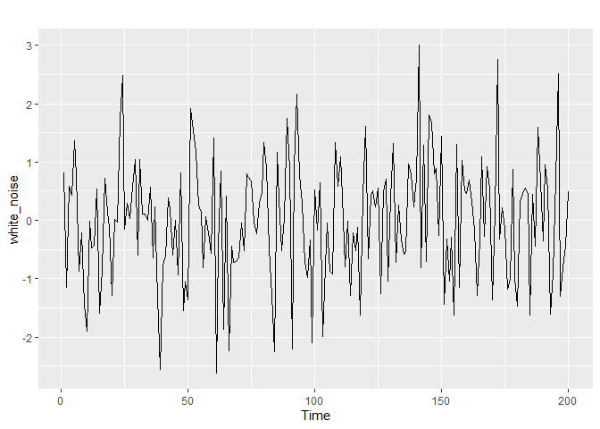<!-- -->

Draw the sample autocorrelation function (ACF) of the white noise process: 

```r
# sample ACF
ggAcf(white_noise, 24)
```

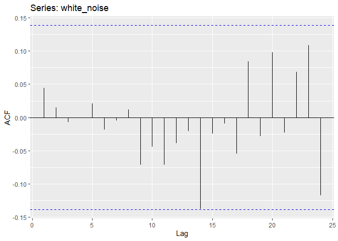<!-- -->

All sample ACs upto 24 lags are within the 95% confidence bands (dashed blue lines). 

## First order Moving Average Process, MA(1)


```r
# simulate an MA(1) process from the white_noise
white_noise_lag1 <- stats::lag(white_noise, -1)
x = white_noise + 0.5* white_noise_lag1
autoplot(x)
```

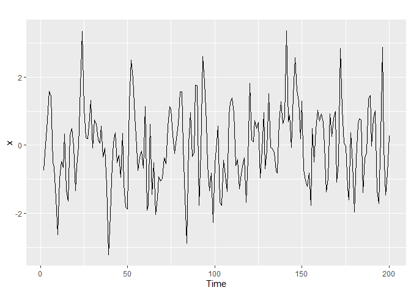<!-- -->


```r
# sample ACF
ma_acf <- ggAcf(x,12)
ma_acf
```

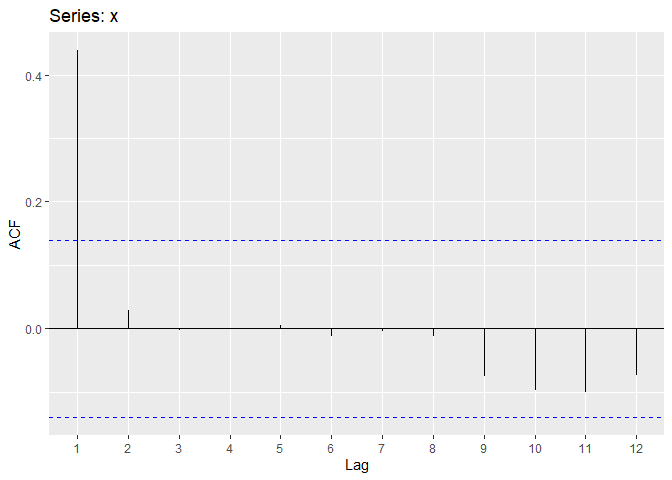<!-- -->

List the sample autocorrelations: 

```r
round(ma_acf$data[,3:4],4)
```

```
##       Freq lag
## 2   0.4380   1
## 3   0.0295   2
## 4  -0.0020   3
## 5   0.0003   4
## 6   0.0056   5
## 7  -0.0112   6
## 8  -0.0043   7
## 9  -0.0125   8
## 10 -0.0751   9
## 11 -0.0963  10
## 12 -0.0998  11
## 13 -0.0726  12
```

The same can be achieved using: 

```r
ma_acf2 <- acf(x, 12)
```

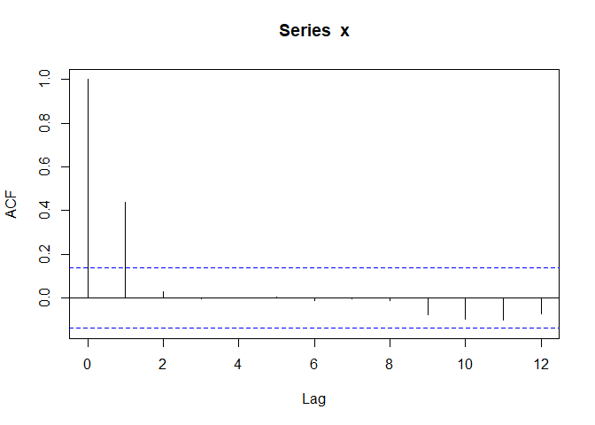<!-- -->

```r
ma_acf2
```

```
## 
## Autocorrelations of series 'x', by lag
## 
##      0      1      2      3      4      5      6      7      8      9     10 
##  1.000  0.438  0.030 -0.002  0.000  0.006 -0.011 -0.004 -0.012 -0.075 -0.096 
##     11     12 
## -0.100 -0.073
```

But note that the list includes lag = 0 which has acf of 1. 
First sample autocorrelation (lag=1) is 0.436. Higher ACs are very close to zero and within the 95% confidence band as expected. MA(1) autocorrelations cut-off at lag=1 and after that they are all zeros at higher lags. MA(1) process is stationary and weakly dependent by definition. 

## MA(2) Process 

Simulate the following MA(2) process
$$y_t = \epsilon_t + 0.8 \epsilon_{t-1}+0.5\epsilon_{t-2}$$
where $\epsilon_t\sim~N(0,1)$. 


```r
# simulate an MA(2) process from the white_noise
set.seed(3242)
e <- ts(rnorm(1000,0,1))
e_lag1 <- stats::lag(e, -1)
e_lag2 <- stats::lag(e, -2)
# print the first obs on the screen 
head(cbind(e, e_lag1, e_lag2), 10)
```

```
## Time Series:
## Start = 1 
## End = 10 
## Frequency = 1 
##             e     e_lag1     e_lag2
##  1 -0.2566057         NA         NA
##  2 -1.0302466 -0.2566057         NA
##  3  1.6253649 -1.0302466 -0.2566057
##  4 -0.9710345  1.6253649 -1.0302466
##  5  1.4248300 -0.9710345  1.6253649
##  6  1.0557943  1.4248300 -0.9710345
##  7 -1.8163343  1.0557943  1.4248300
##  8  0.0253444 -1.8163343  1.0557943
##  9 -0.2043329  0.0253444 -1.8163343
## 10 -0.3802097 -0.2043329  0.0253444
```

```r
# simulate
MA_2_process = e + 0.8*e_lag1 + 0.5*e_lag2
autoplot(MA_2_process)
```

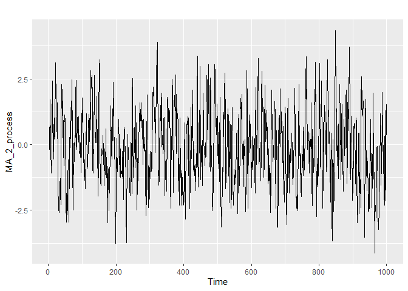<!-- -->

Draw the sample ACF: 

```r
# sample ACF
ggAcf(MA_2_process,12)
```

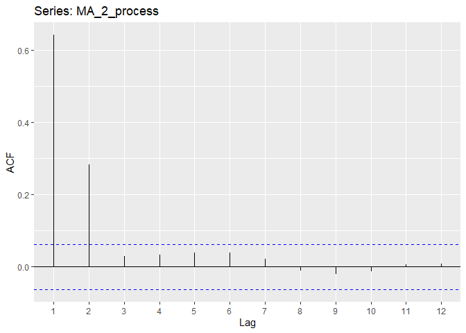<!-- -->

First two lags are nonzero and all higher lags are within the CI. Sample ACF cuts off at lag=2. 

**Exericse:** Compute the first three population autocorrelations. 

## AR(1) Process 

Simulate 4 stationary AR(1) processes with different AR coefficients,
$$y_t = \rho y_{t-1}+\epsilon_t,~~~~~~ \epsilon_t\sim~N(0,1)$$
where $\rho=(0.5,0.8,0.9,0.95)$, suggesting different levels of persistence. Note that as $\rho$ increases (approaches 1), the persistence in the series also increases. We will use `arima.sim()` function from the `stats` package (in base `R`) to simulate an AR process. ARIMA stands for Autoregressive Integrated Moving Average which is a popular class of linear time series models. 


```r
set.seed(1234)
# define the lists for the ARIMA(p,d,q) models
# order = c(1, 0, 0) means ARIMA(1,0,0) = AR(1)
# ar is the AR coefficient and sd is the standard deviation 
list1 <- list(order = c(1, 0, 0), ar = 0.5, sd = 1)
list2 <- list(order = c(1, 0, 0), ar = 0.8, sd = 1)
list3 <- list(order = c(1, 0, 0), ar = 0.9, sd = 1)
list4 <- list(order = c(1, 0, 0), ar = 0.95, sd = 1)
#
AR1_1 <- arima.sim(n = 500, model = list1)
AR1_2 <- arima.sim(n = 500, model = list2)
AR1_3 <- arima.sim(n = 500, model = list3)
AR1_4 <- arima.sim(n = 500, model = list4)
#autoplot(AR1_1)
```


```r
plot1 <- autoplot(AR1_1) + xlab("") + ggtitle("AR(1) = 0.5")
plot2 <- autoplot(AR1_2) + xlab("") + ggtitle("AR(1) = 0.8")
plot3 <- autoplot(AR1_3) + xlab("") + ggtitle("AR(1) = 0.9")
plot4 <- autoplot(AR1_4) + xlab("") + ggtitle("AR(1) = 0.95")
library(grid)
library(gridExtra)
grid.arrange(grobs=list(plot1, plot2, plot3, plot4), 
             ncol=2, top="Simulated AR(1) Processes")
```

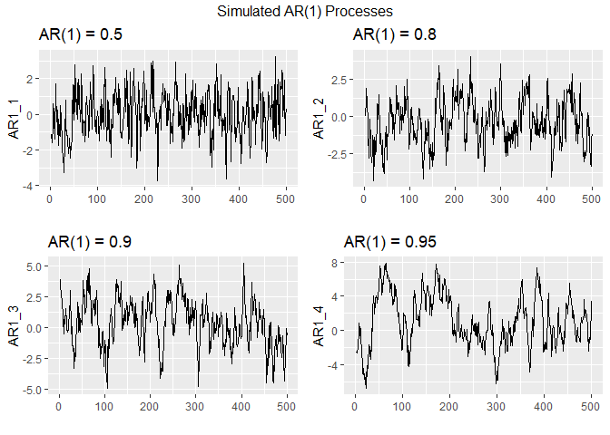<!-- -->


```r
# AR(1) rho = 0.5
acf1 <- ggAcf(AR1_1) + ggtitle('AR(1) process, rho=0.5')
acf1
```

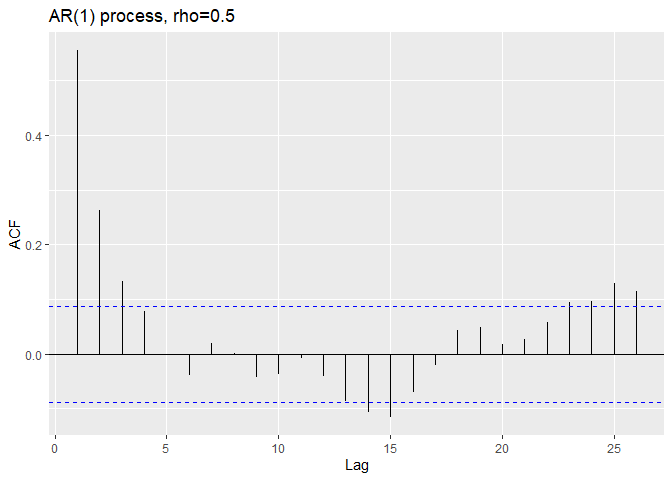<!-- -->


```r
# AR(1) rho = 0.8
acf2 <- ggAcf(AR1_2) + ggtitle('AR(1) process, rho=0.8')
acf2
```

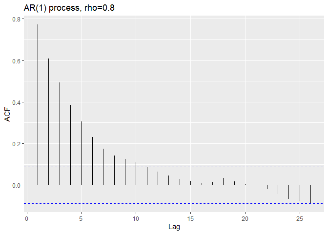<!-- -->


```r
# AR(1) rho = 0.9
acf3 <- ggAcf(AR1_3) + ggtitle('AR(1) process, rho=0.9')
acf3
```

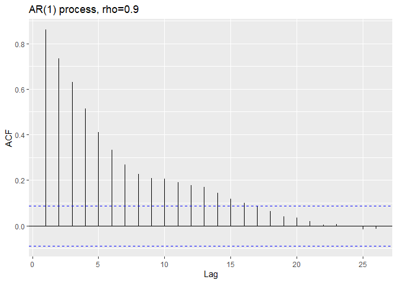<!-- -->


```r
# AR(1) rho = 0.95
acf4 <- ggAcf(AR1_4) + ggtitle('AR(1) process, rho=0.95') 
acf4
```

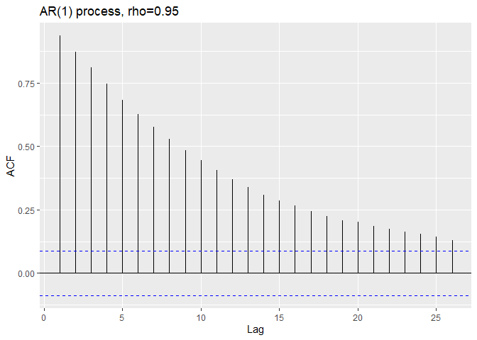<!-- -->


```r
library(grid)
library(gridExtra)
grid.arrange(grobs=list(acf1, acf2, acf3, acf4), 
             ncol=2, top="Correlograms of Simulated AR(1) Processes")
```

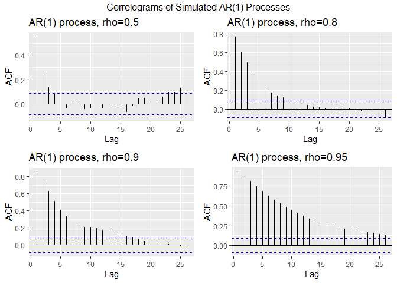<!-- -->


In all cases, the sample ACF of AR(1) process decays to zero as lag order increases. This suggests that **the effects of past shocks diminish over time**. But as $\rho$ increases the dependence to the past also increases as evident in the more persistent decay in the ACF. 

What if $\rho=1$ exactly?

# Nonstationary and Highly Persistent Time Series

## Random Walk Process 

Simulate three random walk processes: 
$$y_t = y_{t-1}+ \epsilon_t$$
where $\epsilon_t$ is a white noise process (we assume it is standard Gaussian random shock in the simulations below) and the initial value is set to 0 for simplicity, i.e., $y_0=0$. 


```r
set.seed(1234)
e1 <- ts(rnorm(500,0,1))
RW1 <- ts(cumsum(e1))
e2 <- ts(rnorm(500,0,1))
RW2 <- ts(cumsum(e2))
e3 <- ts(rnorm(500,0,1))
RW3 <- ts(cumsum(e3))
autoplot(RW1, main = "3 Independent Random Walk Process") + 
  autolayer(RW2) + autolayer(RW3) + theme(legend.position = "none")
```

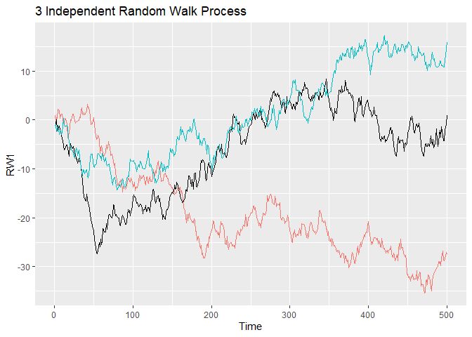<!-- -->

Draw the sample ACF: 

```r
ggAcf(RW1) + ggtitle('Random Walk process, rho=1') 
```

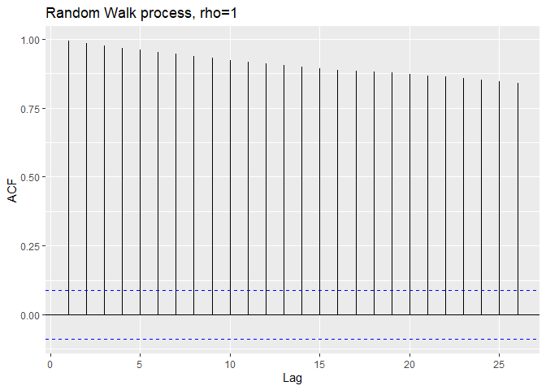<!-- -->


Random Walk process in nonstationary. Shocks to a random walk process have permanent effects. The theoretical ACF is 1 at all lags. The sample ACF may be less than 1 (because we have a finite sample) but decays very slowly to 0. Thus, in practice, a sample ACF that decays slowly to zero may be a sign of a nonstationary process. 


## Random Walk with Drift Process 

Simulate three random walk with drift processes: 
$$y_t = \alpha + y_{t-1}+ \epsilon_t$$
where drift term is set to $\alpha = 0.5$.

```r
set.seed(1234)
drift <- 0.5
n <- 200
t <- 1:n
e1 <- ts(rnorm(n,0,1))
RWD1 <- drift*t + ts(cumsum(e1))
e2 <- ts(rnorm(n,0,1))
RWD2 <- drift*t + ts(cumsum(e2))
e3 <- ts(rnorm(n,0,1))
RWD3 <- drift*t + ts(cumsum(e3))
autoplot(RWD1, main = "3 Independent Random Walk with Drift Process") + 
  autolayer(RWD2) + autolayer(RWD3) + theme(legend.position = "none")
```

<!-- -->

Notice that because of the positive drift term in the process, there is a positive trend in the series which should not be confused with the deterministic trend process. Thus, in practice, when we have a trending variable, we should not automatically assume that it is a linear deterministic trend process. It may well be a random walk with drift which is difference-stationary. We will cover these topics when we discuss unit root tests in our future classes.   


Draw the sample ACF: 

```r
ggAcf(RWD1) + ggtitle('Random Walk with drift process') 
```

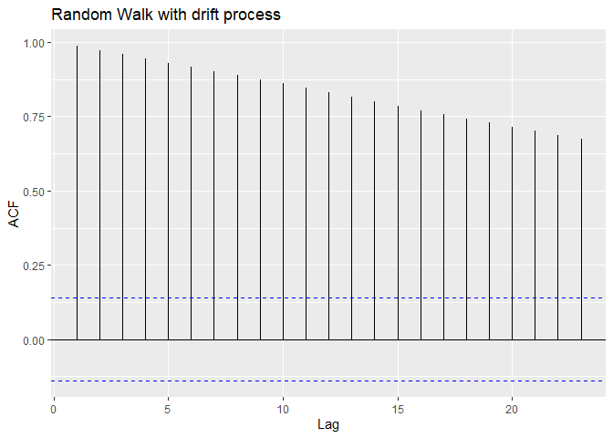<!-- -->

The sample ACF behaves similarly to the random walk process. 

<br>
<div class="tocify-extend-page" data-unique="tocify-extend-page" style="height: 0;"></div>


