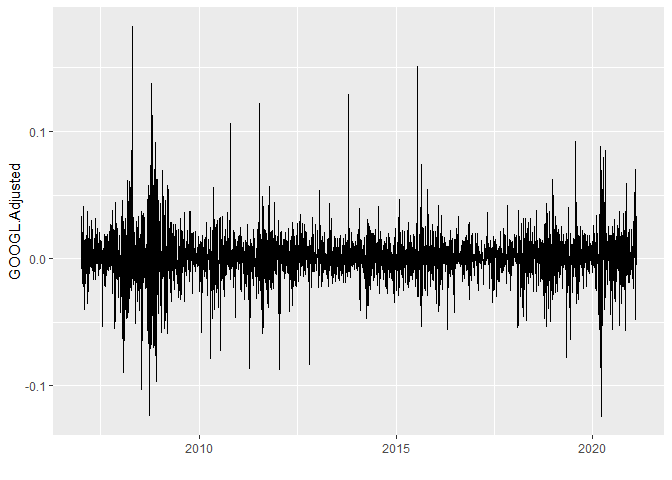

<style type="text/css"> 
body{
  font-size: 12pt;
}
code.r{
  font-size: 12pt;
}
</style>


# Replicating Examples in ch.11 of Wooldridge's Text (6th ed) 

## Example 11.4: Efficient Market Hypothesis

Can we beat the market?


```r
library(wooldridge)
library(dynlm)
library(stargazer)
data(nyse, package='wooldridge') 
nysets <- ts(nyse)
head(nysets)
```

```
##      price     return  return_1 t price_1 price_2     cprice  cprice_1
## [1,] 49.75         NA        NA 1      NA      NA         NA        NA
## [2,] 51.44  3.3969822        NA 2   49.75      NA  1.6899986        NA
## [3,] 52.05  1.1858488 3.3969822 3   51.44   49.75  0.6100006 1.6899986
## [4,] 52.28  0.4418819 1.1858488 4   52.05   51.44  0.2299995 0.6100006
## [5,] 54.24  3.7490492 0.4418819 5   52.28   52.05  1.9600029 0.2299995
## [6,] 53.76 -0.8849619 3.7490492 6   54.24   52.28 -0.4800034 1.9600029
```

Note that because return is defined as 
\[
return_t = 100\times \frac{price_t-price_{t-1}}{price_{t-1}}
\]
the first observation is NA (missing). Also, when we take the first lag of return we lose another observation (see the column `return_1`. The same applies to the changes as well (ie., cprice) which is defined as 
\[
cprice_t \equiv \Delta price_t = price_t - price_{t-1}
\]


Estimate AR(p) models using OLS and summarize the results in a table using `stargazer` package: 

```r
# Dynamic models: AR(p)
reg1 <- dynlm(return ~ L(return)                        , data=nysets) 
reg2 <- dynlm(return ~ L(return)+L(return,2)            , data=nysets) 
reg3 <- dynlm(return ~ L(return)+L(return,2)+L(return,3), data=nysets) 
# Regression Table
stargazer(reg1, reg2, reg3, type="text",
                            keep.stat=c("n","rsq","adj.rsq","f"))
```

```
## 
## ========================================================================
##                                  Dependent variable:                    
##              -----------------------------------------------------------
##                                        return                           
##                      (1)                 (2)                 (3)        
## ------------------------------------------------------------------------
## L(return)           0.059               0.060               0.061       
##                    (0.038)             (0.038)             (0.038)      
##                                                                         
## L(return, 2)                           -0.038              -0.040       
##                                        (0.038)             (0.038)      
##                                                                         
## L(return, 3)                                                0.031       
##                                                            (0.038)      
##                                                                         
## Constant           0.180**             0.186**             0.179**      
##                    (0.081)             (0.081)             (0.082)      
##                                                                         
## ------------------------------------------------------------------------
## Observations         689                 688                 687        
## R2                  0.003               0.005               0.006       
## Adjusted R2         0.002               0.002               0.001       
## F Statistic  2.399 (df = 1; 687) 1.659 (df = 2; 685) 1.322 (df = 3; 683)
## ========================================================================
## Note:                                        *p<0.1; **p<0.05; ***p<0.01
```

**Exercise**: Download Google stock data and estimate AR models with lags 1, 2, and 3. 
**Solution**: Google stock market data data is available in `GOOGL.RData` file in Data folder. This was downloaded from Yahoo Finance using `quantmod` package. Here is the commands I used: 

```r
# Download daily stock market data using quantmod package
# and save the resulting data set (xts object)
library(quantmod) # need this to download stock market data from Yahoo Finance
# Download data using the quantmod package:
getSymbols("GOOGL", auto.assign = TRUE)
# save(GOOGL, file="Data/GOOGL.RData")
```

Load the data set and display the first six observations:

```r
library(forecast)
library(zoo)
library(dynlm)
library(stargazer)
library(ggplot2)
load("../Data/GOOGL.RData")
head(GOOGL)
```

```
##            GOOGL.Open GOOGL.High GOOGL.Low GOOGL.Close GOOGL.Volume
## 2007-01-03   233.2332   238.5686  230.7858    234.0290     15397587
## 2007-01-04   234.7347   242.2172  234.4094    241.8719     15759425
## 2007-01-05   241.4915   243.9940  239.2943    243.8388     13730456
## 2007-01-08   244.0891   245.1802  241.3413    242.0320      9499291
## 2007-01-09   242.9680   244.3694  240.8408    242.9930     10752037
## 2007-01-10   242.4575   247.0220  241.2613    244.9750     11925063
##            GOOGL.Adjusted
## 2007-01-03       234.0290
## 2007-01-04       241.8719
## 2007-01-05       243.8388
## 2007-01-08       242.0320
## 2007-01-09       242.9930
## 2007-01-10       244.9750
```

```r
autoplot(GOOGL[, "GOOGL.Adjusted"]) +
  ggtitle("Google Daily Closing Prices") + xlab("")
```

<!-- -->


```r
# Calculate return as the log difference
googret <- diff(log(GOOGL$GOOGL.Adjusted) )

# Plot returns
autoplot(googret) + xlab("")
```

<!-- -->


```r
# Dynamic models: Ar(1), AR(2), AR(3)
googret <- as.zoo(googret)  # dynlm cannot handle xts objects
reg1 <- dynlm(googret~L(googret) ) 
reg2 <- dynlm(googret~L(googret)+L(googret,2) ) 
reg3 <- dynlm(googret~L(googret)+L(googret,2)+L(googret,3) ) 

# regression table
stargazer(reg1, reg2, reg3, type="text",
                            keep.stat=c("n","rsq","adj.rsq","f"))
```

```
## 
## ===================================================================================
##                                        Dependent variable:                         
##               ---------------------------------------------------------------------
##                                              googret                               
##                         (1)                    (2)                    (3)          
## -----------------------------------------------------------------------------------
## L(googret)           -0.049***              -0.050***              -0.049***       
##                       (0.017)                (0.017)                (0.017)        
##                                                                                    
## L(googret, 2)                                 0.003                  0.002         
##                                              (0.017)                (0.017)        
##                                                                                    
## L(googret, 3)                                                        -0.006        
##                                                                     (0.017)        
##                                                                                    
## Constant              0.001**                0.001**                0.001**        
##                      (0.0003)                (0.0003)               (0.0003)       
##                                                                                    
## -----------------------------------------------------------------------------------
## Observations           3,552                  3,551                  3,550         
## R2                     0.002                  0.002                  0.003         
## Adjusted R2            0.002                  0.002                  0.002         
## F Statistic   8.694*** (df = 1; 3550) 4.396** (df = 2; 3548) 2.970** (df = 3; 3546)
## ===================================================================================
## Note:                                                   *p<0.1; **p<0.05; ***p<0.01
```

**EXercise**: Can we predict Google returns? 

## Example 11.5: Expectations Augmented Phillips Curve


```r
library(forecast)
library(wooldridge) 
library(dynlm) 
tsphillips <- ts(phillips, start=1948, end=1996, frequency = 1)
reg1 <- dynlm(d(inf) ~ unem, data = tsphillips)
summary(reg1)
```

```
## 
## Time series regression with "ts" data:
## Start = 1949, End = 1996
## 
## Call:
## dynlm(formula = d(inf) ~ unem, data = tsphillips)
## 
## Residuals:
##     Min      1Q  Median      3Q     Max 
## -9.1293 -0.7820  0.0611  0.9887  5.3600 
## 
## Coefficients:
##             Estimate Std. Error t value Pr(>|t|)  
## (Intercept)   3.0306     1.3768   2.201   0.0328 *
## unem         -0.5426     0.2302  -2.357   0.0227 *
## ---
## Signif. codes:  0 '***' 0.001 '**' 0.01 '*' 0.05 '.' 0.1 ' ' 1
## 
## Residual standard error: 2.451 on 46 degrees of freedom
## Multiple R-squared:  0.1078,	Adjusted R-squared:  0.0884 
## F-statistic: 5.558 on 1 and 46 DF,  p-value: 0.02271
```


```r
# plot the residuals
uhat <- resid(reg1) 
autoplot(uhat)+ 
  geom_hline(yintercept = 0,linetype="dashed", color = "red")
```

<!-- -->

## Example 11.6: Fertility Equation in First Differences


```r
library(dynlm)
library(stargazer)
data(fertil3, package='wooldridge')

# Define Yearly time series beginning in 1913
fertil_ts <- ts(fertil3, start=1913)
# display the first 5 autocorrelations of gfr
(acf(fertil_ts[, "gfr"], 5))
```

<!-- -->

```
## 
## Autocorrelations of series 'fertil_ts[, "gfr"]', by lag
## 
##     0     1     2     3     4     5 
## 1.000 0.945 0.873 0.807 0.734 0.649
```


```r
# Regression in first differences:
res1 <- dynlm( d(gfr) ~ d(pe), data=fertil_ts)

# FDL in first differences
res2 <- dynlm( d(gfr) ~ d(pe) + L(d(pe)) + L(d(pe),2), data=fertil_ts)

# table
stargazer(res1, res2, type="text") 
```

```
## 
## ============================================================
##                               Dependent variable:           
##                     ----------------------------------------
##                                      d(gfr)                 
##                            (1)                  (2)         
## ------------------------------------------------------------
## d(pe)                     -0.043              -0.036        
##                          (0.028)              (0.027)       
##                                                             
## L(d(pe))                                      -0.014        
##                                               (0.028)       
##                                                             
## L(d(pe), 2)                                  0.110***       
##                                               (0.027)       
##                                                             
## Constant                  -0.785             -0.964**       
##                          (0.502)              (0.468)       
##                                                             
## ------------------------------------------------------------
## Observations                71                  69          
## R2                        0.032                0.232        
## Adjusted R2               0.018                0.197        
## Residual Std. Error  4.221 (df = 69)      3.859 (df = 65)   
## F Statistic         2.263 (df = 1; 69) 6.563*** (df = 3; 65)
## ============================================================
## Note:                            *p<0.1; **p<0.05; ***p<0.01
```

## Example 11.7: Wages and Productivity


```r
# Regression with linear trend
library(dynlm)
library(wooldridge)
data(earns, package='wooldridge')

# Define ts object
earns_ts <- ts(earns, start=1947, end=1987)

fit1 <- dynlm( log(hrwage) ~ log(outphr) + trend(earns_ts), data=earns_ts)
summary(fit1)
```

```
## 
## Time series regression with "ts" data:
## Start = 1947, End = 1987
## 
## Call:
## dynlm(formula = log(hrwage) ~ log(outphr) + trend(earns_ts), 
##     data = earns_ts)
## 
## Residuals:
##       Min        1Q    Median        3Q       Max 
## -0.059230 -0.026151  0.002412  0.020322  0.051965 
## 
## Coefficients:
##                  Estimate Std. Error t value Pr(>|t|)    
## (Intercept)     -5.328456   0.374448  -14.23  < 2e-16 ***
## log(outphr)      1.639640   0.093347   17.57  < 2e-16 ***
## trend(earns_ts) -0.018230   0.001748  -10.43 1.05e-12 ***
## ---
## Signif. codes:  0 '***' 0.001 '**' 0.01 '*' 0.05 '.' 0.1 ' ' 1
## 
## Residual standard error: 0.02854 on 38 degrees of freedom
## Multiple R-squared:  0.9712,	Adjusted R-squared:  0.9697 
## F-statistic: 641.2 on 2 and 38 DF,  p-value: < 2.2e-16
```


```r
# Regression in first differences
fit2 <- dynlm( d(log(hrwage)) ~ d(log(outphr)), data=earns_ts)
summary(fit2)
```

```
## 
## Time series regression with "ts" data:
## Start = 1948, End = 1987
## 
## Call:
## dynlm(formula = d(log(hrwage)) ~ d(log(outphr)), data = earns_ts)
## 
## Residuals:
##       Min        1Q    Median        3Q       Max 
## -0.040921 -0.010165 -0.000383  0.007969  0.040329 
## 
## Coefficients:
##                 Estimate Std. Error t value Pr(>|t|)    
## (Intercept)    -0.003662   0.004220  -0.868    0.391    
## d(log(outphr))  0.809317   0.173454   4.666 3.75e-05 ***
## ---
## Signif. codes:  0 '***' 0.001 '**' 0.01 '*' 0.05 '.' 0.1 ' ' 1
## 
## Residual standard error: 0.01695 on 38 degrees of freedom
## Multiple R-squared:  0.3642,	Adjusted R-squared:  0.3475 
## F-statistic: 21.77 on 1 and 38 DF,  p-value: 3.748e-05
```

**Exercise** Write down both models in equation form and interpret the results. 

<br>
<div class="tocify-extend-page" data-unique="tocify-extend-page" style="height: 0;"></div>


