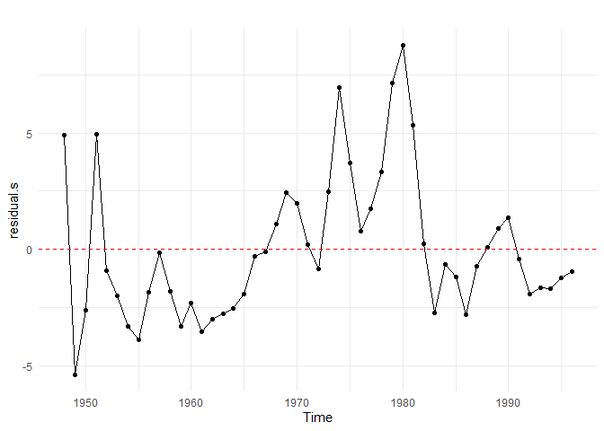
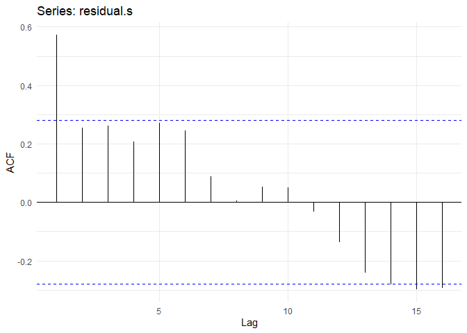
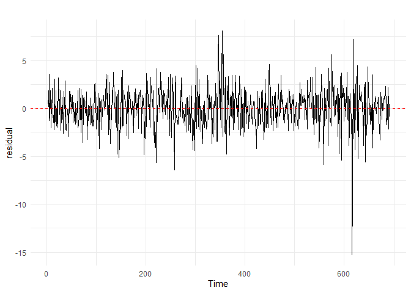
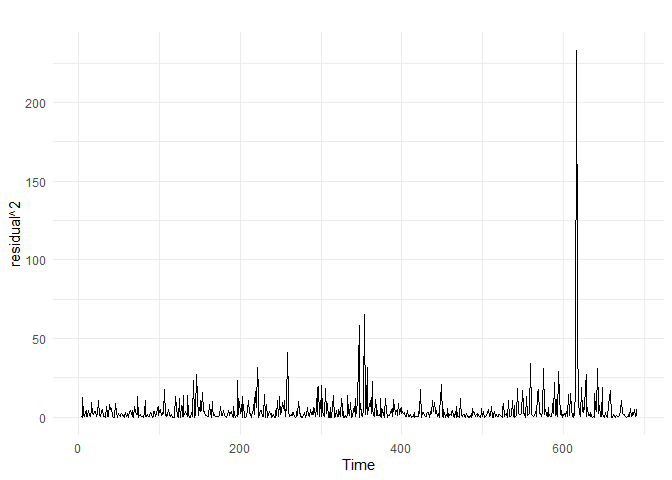
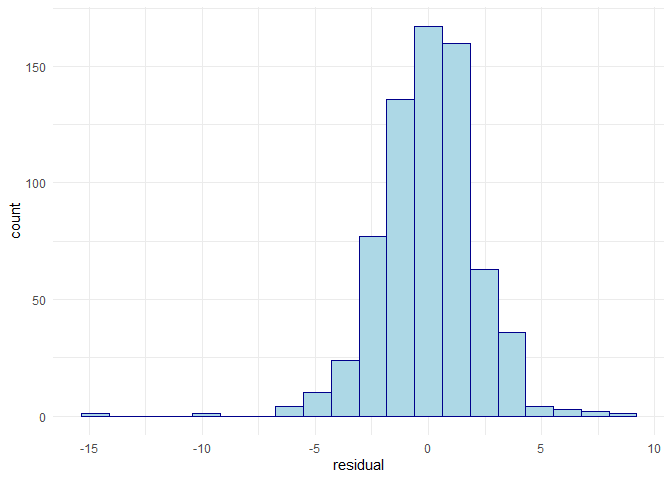
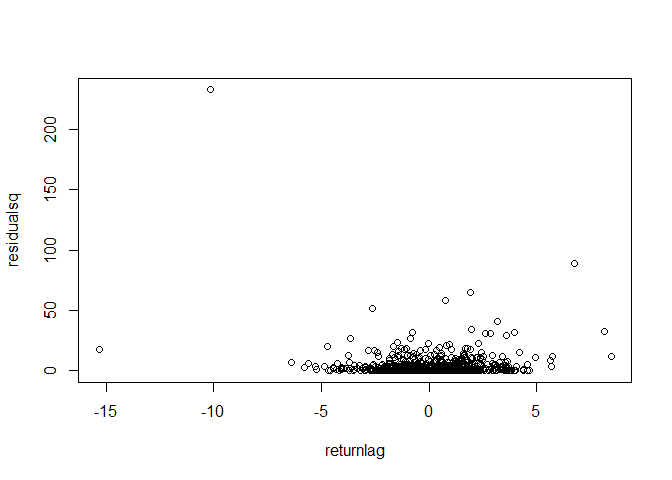

<style type="text/css"> 
body{
  font-size: 12pt;
}
code.r{
  font-size: 12pt;
}
</style>


# Replicating Examples in ch.12 of Wooldridge's Text (6th ed) 

## Example 12.1: AR(1) t-test for the Phillips Curve Regressions

### Static Phillips Curve


```r
library(wooldridge)
library(dynlm)
library(lmtest)
data(phillips, package='wooldridge')

# Define Yearly time series beginning in 1948
tsdata <- ts(phillips, start=1948)

# Estimation of static Phillips curve:
reg.s <- dynlm( inf ~ unem, data=tsdata, end=1996)
summary(reg.s)
```

```
## 
## Time series regression with "ts" data:
## Start = 1948, End = 1996
## 
## Call:
## dynlm(formula = inf ~ unem, data = tsdata, end = 1996)
## 
## Residuals:
##     Min      1Q  Median      3Q     Max 
## -5.3826 -1.9797 -0.7229  1.3577  8.7562 
## 
## Coefficients:
##             Estimate Std. Error t value Pr(>|t|)
## (Intercept)   1.4236     1.7190   0.828    0.412
## unem          0.4676     0.2891   1.617    0.112
## 
## Residual standard error: 3.131 on 47 degrees of freedom
## Multiple R-squared:  0.05272,	Adjusted R-squared:  0.03257 
## F-statistic: 2.616 on 1 and 47 DF,  p-value: 0.1125
```


```r
# save the residuals from the static model
residual.s <- ts(resid(reg.s), start=1948, end=1996)
# graph
library(forecast)
library(ggplot2)
forecast::autoplot(residual.s) + geom_point(aes(y=residual.s)) +
  geom_hline(yintercept = 0,linetype="dashed", color = "red") +
  theme_minimal()
```

<!-- -->


```r
# Sample Autocorrelation Function of residuals
forecast::ggAcf(residual.s) + theme_minimal()
```

<!-- -->


```r
# AR(1) test regression
ttestreg <- dynlm(residual.s ~ L(residual.s)) 
coeftest(ttestreg)
```

```
## 
## t test of coefficients:
## 
##               Estimate Std. Error t value  Pr(>|t|)    
## (Intercept)   -0.11340    0.35940 -0.3155    0.7538    
## L(residual.s)  0.57297    0.11613  4.9337 1.098e-05 ***
## ---
## Signif. codes:  0 '***' 0.001 '**' 0.01 '*' 0.05 '.' 0.1 ' ' 1
```

### Expectations Augmented Phillips Curve


```r
# Same with expectations-augmented Phillips curve:
reg.ea <- dynlm( d(inf) ~ unem, data=tsdata, end=1996)
residual.ea <- resid(reg.ea)
coeftest( dynlm(residual.ea ~ L(residual.ea)) )
```

```
## 
## t test of coefficients:
## 
##                 Estimate Std. Error t value Pr(>|t|)
## (Intercept)     0.194166   0.300384  0.6464   0.5213
## L(residual.ea) -0.035593   0.123891 -0.2873   0.7752
```

Durbin-Watson test: 

```r
# DW test for the static Phillips curve
library(lmtest)
dwtest(reg.s)
```

```
## 
## 	Durbin-Watson test
## 
## data:  reg.s
## DW = 0.8027, p-value = 7.552e-07
## alternative hypothesis: true autocorrelation is greater than 0
```


```r
# DW test for the expectations-augmented Phillips curve
library(lmtest)
dwtest(reg.ea)
```

```
## 
## 	Durbin-Watson test
## 
## data:  reg.ea
## DW = 1.7696, p-value = 0.1783
## alternative hypothesis: true autocorrelation is greater than 0
```

## Example 12.2: AR(1) t-test with non-strictly exogenous regressors 

This example use Puerto Rican minimum wage regression model which 
we saw in chapter 10. 


```r
tsprminwage <- ts(prminwge, start=1950)
minwage <- dynlm(lprepop ~ lmincov + lusgnp + lprgnp + 
                   trend(tsprminwage, scale=FALSE), data = tsprminwage)
summary(minwage)
```

```
## 
## Time series regression with "ts" data:
## Start = 1950, End = 1987
## 
## Call:
## dynlm(formula = lprepop ~ lmincov + lusgnp + lprgnp + trend(tsprminwage, 
##     scale = FALSE), data = tsprminwage)
## 
## Residuals:
##       Min        1Q    Median        3Q       Max 
## -0.054679 -0.023653 -0.004039  0.018638  0.076947 
## 
## Coefficients:
##                                    Estimate Std. Error t value Pr(>|t|)    
## (Intercept)                       -6.663432   1.257831  -5.298 7.67e-06 ***
## lmincov                           -0.212261   0.040152  -5.286 7.92e-06 ***
## lusgnp                             0.486046   0.221983   2.190   0.0357 *  
## lprgnp                             0.285239   0.080492   3.544   0.0012 ** 
## trend(tsprminwage, scale = FALSE) -0.026663   0.004627  -5.763 1.94e-06 ***
## ---
## Signif. codes:  0 '***' 0.001 '**' 0.01 '*' 0.05 '.' 0.1 ' ' 1
## 
## Residual standard error: 0.03277 on 33 degrees of freedom
## Multiple R-squared:  0.8892,	Adjusted R-squared:  0.8758 
## F-statistic: 66.23 on 4 and 33 DF,  p-value: 2.677e-15
```


```r
# obtain residuals 
library(dynlm)
library(lmtest) 
resid <- residuals(minwage)
ARtest <- dynlm(resid ~ L(resid) + lmincov + lusgnp + lprgnp + trend(tsprminwage), data=tsprminwage)
coeftest(ARtest)
```

```
## 
## t test of coefficients:
## 
##                      Estimate Std. Error t value Pr(>|t|)   
## (Intercept)        -0.8507721  1.0926905 -0.7786 0.442117   
## L(resid)            0.4805093  0.1664442  2.8869 0.007029 **
## lmincov             0.0375001  0.0352123  1.0650 0.295114   
## lusgnp              0.2039325  0.1951588  1.0450 0.304123   
## lprgnp             -0.0784656  0.0705240 -1.1126 0.274430   
## trend(tsprminwage) -0.0034662  0.0040736 -0.8509 0.401345   
## ---
## Signif. codes:  0 '***' 0.001 '**' 0.01 '*' 0.05 '.' 0.1 ' ' 1
```

From the output we see that the coefficent estimate on the lagged residual, `L(resid)`, is 
$\hat{\rho}=0.48$ with $t=2.89$ which has a small p-value (0.007). Thus, we reject the null hypothesis of no serial correlation. 


## Example 12.3: Testing for AR(3) serial correlation


```r
library(dynlm)
library(car)
library(lmtest)
data(barium, package='wooldridge')
tsdata <- ts(barium, start=c(1978,2), frequency=12)
# regression
reg <- dynlm(log(chnimp)~log(chempi)+log(gas)+log(rtwex)+
                                  befile6+affile6+afdec6, data=tsdata )

# Test regression
residual <- resid(reg)
resreg <- dynlm(residual ~ L(residual)+L(residual,2)+L(residual,3)+
                           log(chempi)+log(gas)+log(rtwex)+befile6+
                                          affile6+afdec6, data=tsdata )
linearHypothesis(resreg, 
                 c("L(residual)","L(residual, 2)","L(residual, 3)"))
```

```
## Linear hypothesis test
## 
## Hypothesis:
## L(residual) = 0
## L(residual, 2) = 0
## L(residual, 3) = 0
## 
## Model 1: restricted model
## Model 2: residual ~ L(residual) + L(residual, 2) + L(residual, 3) + log(chempi) + 
##     log(gas) + log(rtwex) + befile6 + affile6 + afdec6
## 
##   Res.Df    RSS Df Sum of Sq      F  Pr(>F)   
## 1    121 43.394                               
## 2    118 38.394  3    5.0005 5.1229 0.00229 **
## ---
## Signif. codes:  0 '***' 0.001 '**' 0.01 '*' 0.05 '.' 0.1 ' ' 1
```

This can be automatically computed using `bgtest()` function in the `lmtest` package.


```r
# Automatic test:
bgtest(reg, order=3, type="F")
```

```
## 
## 	Breusch-Godfrey test for serial correlation of order up to 3
## 
## data:  reg
## LM test = 5.1247, df1 = 3, df2 = 121, p-value = 0.002264
```

The LM version of the test is called the Breusch-Godfrey serial correlation test which can be computed using 


```r
# LM version (Breusch-Godfrey autocorrelation test)
bgtest(reg, order=3, type="Chisq")
```

```
## 
## 	Breusch-Godfrey test for serial correlation of order up to 3
## 
## data:  reg
## LM test = 14.768, df = 3, p-value = 0.002026
```


## Example 12.4: FGLS Estimation (barium data) 

Cochrane-Orcutt estimation: 


```r
library(dynlm)
library(car)
library(orcutt)
data(barium, package='wooldridge')
tsdata <- ts(barium, start=c(1978,2), frequency=12)

# OLS estimation
olsres <- dynlm(log(chnimp) ~ log(chempi) + log(gas) + log(rtwex) +
      befile6 + affile6 + afdec6, data=tsdata)

# Cochrane-Orcutt estimation
cochrane.orcutt(olsres)
```

```
## Cochrane-orcutt estimation for first order autocorrelation 
##  
## Call:
## dynlm(formula = log(chnimp) ~ log(chempi) + log(gas) + log(rtwex) + 
##     befile6 + affile6 + afdec6, data = tsdata)
## 
##  number of interaction: 8
##  rho 0.293362
## 
## Durbin-Watson statistic 
## (original):    1.45841 , p-value: 1.688e-04
## (transformed): 2.06330 , p-value: 4.91e-01
##  
##  coefficients: 
## (Intercept) log(chempi)    log(gas)  log(rtwex)     befile6     affile6 
##  -37.322241    2.947434    1.054858    1.136918   -0.016372   -0.033082 
##      afdec6 
##   -0.577158
```

Prais-Winsten estimation: 


```r
library(dynlm)
library(car)
library(prais)
data(barium, package='wooldridge')
tsdata <- ts(barium, start=c(1978,2), frequency=12)

# OLS estimation
olsres <- dynlm(log(chnimp) ~ log(chempi) + log(gas) + log(rtwex) +
      befile6 + affile6 + afdec6, data=tsdata)

# Prais-Winsten estimation
prais_winsten(log(chnimp) ~ log(chempi) + log(gas) + log(rtwex) +
      befile6 + affile6 + afdec6, data=tsdata)
```

```
## Iteration 0: rho = 0
## Iteration 1: rho = 0.2708
## Iteration 2: rho = 0.291
## Iteration 3: rho = 0.293
## Iteration 4: rho = 0.2932
## Iteration 5: rho = 0.2932
## Iteration 6: rho = 0.2932
## Iteration 7: rho = 0.2932
```

```
## 
## Call:
## prais_winsten(formula = log(chnimp) ~ log(chempi) + log(gas) + 
##     log(rtwex) + befile6 + affile6 + afdec6, data = tsdata)
## 
## Coefficients:
## (Intercept)  log(chempi)     log(gas)   log(rtwex)      befile6      affile6  
##   -37.07742      2.94095      1.04637      1.13279     -0.01648     -0.03316  
##      afdec6  
##    -0.57681  
## 
## AR(1) coefficient rho: 0.2932
```

The Prais-Winsten estimation results can be compared to those in Table 12.1 on page 384 of the text. Also, the Cohcrane-Orcutt and Prais-Winsten FGLS results are practically the same. 


## Example 12.5: FGLS Estimation (Phillips Curve) 


```r
library(wooldridge)
library(dynlm)
library(stargazer)
library(prais)
data(phillips, package='wooldridge')

# Define Yearly time series beginning in 1948
tsdata <- ts(phillips, start=1948, end=1996)

# Estimation of static Phillips curve:
reg.s <- dynlm( inf ~ unem, data=tsdata) 
summary(reg.s)
```

```
## 
## Time series regression with "ts" data:
## Start = 1948, End = 1996
## 
## Call:
## dynlm(formula = inf ~ unem, data = tsdata)
## 
## Residuals:
##     Min      1Q  Median      3Q     Max 
## -5.3826 -1.9797 -0.7229  1.3577  8.7562 
## 
## Coefficients:
##             Estimate Std. Error t value Pr(>|t|)
## (Intercept)   1.4236     1.7190   0.828    0.412
## unem          0.4676     0.2891   1.617    0.112
## 
## Residual standard error: 3.131 on 47 degrees of freedom
## Multiple R-squared:  0.05272,	Adjusted R-squared:  0.03257 
## F-statistic: 2.616 on 1 and 47 DF,  p-value: 0.1125
```


```r
# Prais-Winsten
reg.pw <- prais_winsten(inf ~ unem, data=tsdata)
summary(reg.pw)
```

```
## Iteration 0: rho = 0
## Iteration 1: rho = 0.5727
## Iteration 2: rho = 0.7307
## Iteration 3: rho = 0.7719
## Iteration 4: rho = 0.7792
## Iteration 5: rho = 0.7803
## Iteration 6: rho = 0.7805
## Iteration 7: rho = 0.7805
## Iteration 8: rho = 0.7805
## Iteration 9: rho = 0.7805
## 
## Call:
## prais_winsten(formula = inf ~ unem, data = tsdata)
## 
## Residuals:
##     Min      1Q  Median      3Q     Max 
## -5.5470 -2.6764 -0.3579  1.4108 10.2853 
## 
## AR(1) coefficient rho after 9 Iterations: 0.7805
## 
## Coefficients:
##             Estimate Std. Error t value Pr(>|t|)    
## (Intercept)   8.2959     2.2314   3.718 0.000535 ***
## unem         -0.7157     0.3135  -2.283 0.026988 *  
## ---
## Signif. codes:  0 '***' 0.001 '**' 0.01 '*' 0.05 '.' 0.1 ' ' 1
## 
## Residual standard error: 2.267 on 47 degrees of freedom
## Multiple R-squared:  0.1358,	Adjusted R-squared:  0.1174 
## F-statistic: 7.386 on 1 and 47 DF,  p-value: 0.009174
## 
## Durbin-Watson statistic (original): 0.8027 
## Durbin-Watson statistic (transformed):  1.91
```


```r
# Cochrane-Orcutt
cochrane.orcutt(reg.s)
```

```
## Cochrane-orcutt estimation for first order autocorrelation 
##  
## Call:
## dynlm(formula = inf ~ unem, data = tsdata)
## 
##  number of interaction: 13
##  rho 0.774051
## 
## Durbin-Watson statistic 
## (original):    0.80270 , p-value: 7.552e-07
## (transformed): 1.59363 , p-value: 7.447e-02
##  
##  coefficients: 
## (Intercept)        unem 
##    7.583459   -0.665336
```

## Example 12.6: Differencing (interest rate equation) 

This is based on Example 10.2: Effects of Inflation and Deficits on Interest Rates. 


```r
library(wooldridge)
library(dynlm)
# create a ts object 
tsintdef <- ts(intdef, start=1948, frequency = 1) 
```


```r
# static model:
intmodel <- dynlm(d(i3) ~ d(inf) + d(def), data = tsintdef)
summary(intmodel)
```

```
## 
## Time series regression with "ts" data:
## Start = 1949, End = 2003
## 
## Call:
## dynlm(formula = d(i3) ~ d(inf) + d(def), data = tsintdef)
## 
## Residuals:
##      Min       1Q   Median       3Q      Max 
## -2.53316 -0.96248 -0.08658  0.75884  2.93846 
## 
## Coefficients:
##             Estimate Std. Error t value Pr(>|t|)
## (Intercept)  0.04177    0.17139   0.244    0.808
## d(inf)       0.14949    0.09216   1.622    0.111
## d(def)      -0.18132    0.14768  -1.228    0.225
## 
## Residual standard error: 1.265 on 52 degrees of freedom
## Multiple R-squared:  0.1763,	Adjusted R-squared:  0.1446 
## F-statistic: 5.566 on 2 and 52 DF,  p-value: 0.006451
```

## Example 12.7: The Puerto Rican Minimum Wage


```r
library(dynlm) 
library(lmtest)
library(sandwich)
data(prminwge, package='wooldridge')

tsdata <- ts(prminwge, start=1950)

# OLS regression
reg<-dynlm(log(prepop)~log(mincov)+log(prgnp)+log(usgnp)+trend(tsdata), 
                                                          data=tsdata )
# results with usual SE
coeftest(reg)
```

```
## 
## t test of coefficients:
## 
##                 Estimate Std. Error t value  Pr(>|t|)    
## (Intercept)   -6.6634416  1.2578286 -5.2976 7.667e-06 ***
## log(mincov)   -0.2122612  0.0401523 -5.2864 7.924e-06 ***
## log(prgnp)     0.2852380  0.0804921  3.5437  0.001203 ** 
## log(usgnp)     0.4860483  0.2219825  2.1896  0.035731 *  
## trend(tsdata) -0.0266633  0.0046267 -5.7629 1.940e-06 ***
## ---
## Signif. codes:  0 '***' 0.001 '**' 0.01 '*' 0.05 '.' 0.1 ' ' 1
```

```r
# results with HAC SE
coeftest(reg, vcovHAC)
```

```
## 
## t test of coefficients:
## 
##                 Estimate Std. Error t value  Pr(>|t|)    
## (Intercept)   -6.6634416  1.6856885 -3.9529 0.0003845 ***
## log(mincov)   -0.2122612  0.0460684 -4.6075 5.835e-05 ***
## log(prgnp)     0.2852380  0.1034901  2.7562 0.0094497 ** 
## log(usgnp)     0.4860483  0.3108940  1.5634 0.1275013    
## trend(tsdata) -0.0266633  0.0054301 -4.9103 2.402e-05 ***
## ---
## Signif. codes:  0 '***' 0.001 '**' 0.01 '*' 0.05 '.' 0.1 ' ' 1
```

## Example 12.8: Heteroskedasticity in time series regressions (EMH)


```r
library(dynlm)
library(lmtest)
data(nyse, package='wooldridge')

tsnyse <- ts(nyse)

# Linear regression of model:
reg <- dynlm(return ~ L(return), data=tsnyse) 
summary(reg)
```

```
## 
## Time series regression with "ts" data:
## Start = 3, End = 691
## 
## Call:
## dynlm(formula = return ~ L(return), data = tsnyse)
## 
## Residuals:
##     Min      1Q  Median      3Q     Max 
## -15.261  -1.302   0.098   1.316   8.065 
## 
## Coefficients:
##             Estimate Std. Error t value Pr(>|t|)  
## (Intercept)  0.17963    0.08074   2.225   0.0264 *
## L(return)    0.05890    0.03802   1.549   0.1218  
## ---
## Signif. codes:  0 '***' 0.001 '**' 0.01 '*' 0.05 '.' 0.1 ' ' 1
## 
## Residual standard error: 2.11 on 687 degrees of freedom
##   (1 observation deleted due to missingness)
## Multiple R-squared:  0.003481,	Adjusted R-squared:  0.00203 
## F-statistic: 2.399 on 1 and 687 DF,  p-value: 0.1218
```

```r
residual <- residuals(reg)
```


```r
library(ggplot2)
autoplot(residual)+ 
  geom_hline(yintercept = 0,linetype="dashed", color = "red") + 
  theme_minimal()
```

<!-- -->

```r
# squared residuals 
autoplot(residual^2)+theme_minimal()
```

<!-- -->

```r
# histogram
ggplot(residual,aes(x=residual)) + 
  geom_histogram(color = "darkblue",fill = "lightblue", bins = 20) + 
  theme_minimal()
```

<!-- -->


```r
residualsq <- residual^2
return <- ts(nyse$return)
returnlag <- stats::lag(return,1)
plot(returnlag, residualsq)
```

<!-- -->

Now, regress squared residuals on explanatory variables (here we have a single X
variable, lagged return)


```r
hettest <- dynlm(residualsq ~ L(return), data=tsnyse)
summary(hettest)
```

```
## 
## Time series regression with "ts" data:
## Start = 3, End = 691
## 
## Call:
## dynlm(formula = residualsq ~ L(return), data = tsnyse)
## 
## Residuals:
##     Min      1Q  Median      3Q     Max 
##  -9.689  -3.929  -2.021   0.960 223.730 
## 
## Coefficients:
##             Estimate Std. Error t value Pr(>|t|)    
## (Intercept)   4.6565     0.4277  10.888  < 2e-16 ***
## L(return)    -1.1041     0.2014  -5.482  5.9e-08 ***
## ---
## Signif. codes:  0 '***' 0.001 '**' 0.01 '*' 0.05 '.' 0.1 ' ' 1
## 
## Residual standard error: 11.18 on 687 degrees of freedom
## Multiple R-squared:  0.04191,	Adjusted R-squared:  0.04052 
## F-statistic: 30.05 on 1 and 687 DF,  p-value: 5.905e-08
```

The t statistic on $return_{t-1}$ is $t=-1.104/0.201=-5.482$ with a very small p
value. Thus, we reject the null hypothesis that there is no heteroskedasticity. The result can be written in equation form as 

$$\hat{u}_{t}^{2}=4.66-1.104 \text { return }_{t-1}+\text { residual}_{t}$$


In fact, squared residuals, a measure of market volatility, is inversely related to the lagged return. This suggests that this week's volatility is predicted to be lower if the previous week's return is high (and vice versa). Overall, the results suggest that while returns may not be predicted using past information (thus EMH holds), the volatility (or variance) can be predicted. 


## Example 12.9: ARCH model 

ARCH (Autoregressive Conditional Heteroskedasticity) model provides a dynamic form of heteroskedasticity especially important for financial data. It can be written as 

$$u_{t}^{2}=\alpha_{0}+\alpha_{1} u_{t-1}^{2}+v_{t}$$
which is basically an AR(1) model in squared residuals. This implies that we must impose the stability condition, $\alpha_1<1$. Also, error terms themselves, $u_t$, must be serially uncorrelated.  


```r
library(dynlm)
library(lmtest)
data(nyse, package='wooldridge')

tsnyse <- ts(nyse)

# Linear regression of model:
reg <- dynlm(return ~ L(return), data=tsnyse) 

# squared residual
residual.sq <- resid(reg)^2

# Model for squared residual:
ARCHreg <- dynlm(residual.sq ~ L(residual.sq)) 
coeftest(ARCHreg)
```

```
## 
## t test of coefficients:
## 
##                Estimate Std. Error t value  Pr(>|t|)    
## (Intercept)    2.947433   0.440234  6.6951 4.485e-11 ***
## L(residual.sq) 0.337062   0.035947  9.3767 < 2.2e-16 ***
## ---
## Signif. codes:  0 '***' 0.001 '**' 0.01 '*' 0.05 '.' 0.1 ' ' 1
```

$$\hat{u}_{t}^{2}=2.95+.337 \hat{u}_{t-1}^{2}+\text {residual}_{t}$$

Check if residuals are autocorrelated: 


```r
residual <- resid(reg)
summary(dynlm(residual ~ L(residual)))
```

```
## 
## Time series regression with "ts" data:
## Start = 4, End = 691
## 
## Call:
## dynlm(formula = residual ~ L(residual))
## 
## Residuals:
##      Min       1Q   Median       3Q      Max 
## -15.2538  -1.3024   0.0912   1.3217   8.0613 
## 
## Coefficients:
##              Estimate Std. Error t value Pr(>|t|)
## (Intercept) -0.001171   0.080508  -0.015    0.988
## L(residual)  0.001405   0.038177   0.037    0.971
## 
## Residual standard error: 2.112 on 686 degrees of freedom
## Multiple R-squared:  1.974e-06,	Adjusted R-squared:  -0.001456 
## F-statistic: 0.001354 on 1 and 686 DF,  p-value: 0.9707
```

Is lagged residual statistically significant?

<br>
<div class="tocify-extend-page" data-unique="tocify-extend-page" style="height: 0;"></div>


 
