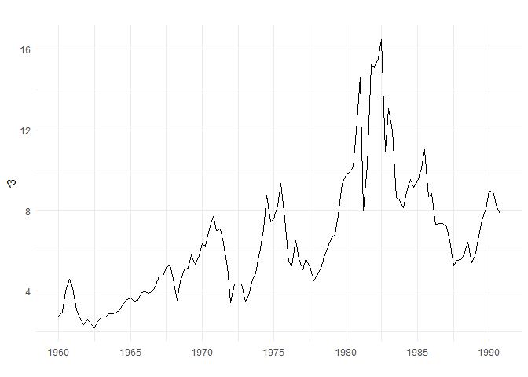

<style type="text/css"> 
body{
  font-size: 12pt;
}
code.r{
  font-size: 12pt;
}
</style>


# Replicating in-class examples

## Example 18.2: Unit Root Test for Three-Month T-Bill Rates


Load packages, data set, and plot 3-month treasury bill rates: 

```r
library(wooldridge)
library(dynlm)
library(lmtest)

tsdata <- ts(intqrt, start = 1960, frequency = 4)
r3 <- ts(intqrt$r3, start = 1960, frequency = 4)

library(forecast)
library(ggplot2)
autoplot(r3) + 
  theme_minimal() + xlab("")
```

<!-- -->

Next we run the DF test regression which is just the regression of differenced 
variable on the lagged variable (we include a constant term but not trend)


```r
# run DF test regression  
reg1 <- dynlm(d(r3) ~ L(r3), data=tsdata)
summary(reg1)
```

```
## 
## Time series regression with "ts" data:
## Start = 1960(2), End = 1990(4)
## 
## Call:
## dynlm(formula = d(r3) ~ L(r3), data = tsdata)
## 
## Residuals:
##     Min      1Q  Median      3Q     Max 
## -5.9291 -0.4688  0.0102  0.5640  5.2926 
## 
## Coefficients:
##             Estimate Std. Error t value Pr(>|t|)  
## (Intercept)  0.62534    0.26083   2.398   0.0180 *
## L(r3)       -0.09071    0.03668  -2.473   0.0148 *
## ---
## Signif. codes:  0 '***' 0.001 '**' 0.01 '*' 0.05 '.' 0.1 ' ' 1
## 
## Residual standard error: 1.228 on 121 degrees of freedom
## Multiple R-squared:  0.04812,	Adjusted R-squared:  0.04025 
## F-statistic: 6.116 on 1 and 121 DF,  p-value: 0.01478
```

```r
bhat <- coef(reg1)[2]
se.bhat <- sqrt(diag(vcov(reg1)))[2]
# another way to extract se 
# summary(reg1)$coef[2,2]
```

DF test statistic is simply the t-ratio: 

```r
DF <- bhat/se.bhat
DF
```

```
##     L(r3) 
## -2.473151
```

```r
# compare to critical values for the case without trend
# cv = -2.86 at 5%
```
Because DF is larger than the critical value at 5% level, we **fail to reject** the null hypothesis. Thus, 3-months treasury bill rate is **nonstationary**.

Is the first difference stationary? The DF statistic suggested that T-bill rate may be difference-stationary, i.e., its first difference may be stationary, I(1). To check this, we take the first difference and then run the DF test again: 


```r
# take diff and then plot
dr3 <- diff(r3)
autoplot(dr3) + 
  theme_minimal() +
  xlab("") + 
  ylab("First difference of r3")
```

<!-- -->

The plot of differenced series suggest that it fluctuates around a constant. It may in fact be stationary. Here is the DF test regression: 

```r
# DF test regression 
reg2 <- dynlm(d(dr3) ~ L(dr3))
summary(reg2)
```

```
## 
## Time series regression with "ts" data:
## Start = 1960(3), End = 1990(4)
## 
## Call:
## dynlm(formula = d(dr3) ~ L(dr3))
## 
## Residuals:
##     Min      1Q  Median      3Q     Max 
## -6.3661 -0.4093  0.1100  0.6155  5.2041 
## 
## Coefficients:
##             Estimate Std. Error t value Pr(>|t|)    
## (Intercept)  0.04511    0.11373   0.397    0.692    
## L(dr3)      -1.11573    0.09070 -12.302   <2e-16 ***
## ---
## Signif. codes:  0 '***' 0.001 '**' 0.01 '*' 0.05 '.' 0.1 ' ' 1
## 
## Residual standard error: 1.255 on 120 degrees of freedom
## Multiple R-squared:  0.5577,	Adjusted R-squared:  0.554 
## F-statistic: 151.3 on 1 and 120 DF,  p-value: < 2.2e-16
```

```r
bhat2 <- coef(reg2)[2]
se.bhat2 <- sqrt(diag(vcov(reg2)))[2] 
```

DF statistic: 

```r
DF2 <- bhat2/se.bhat2
DF2
```

```
##    L(dr3) 
## -12.30162
```

DF test statistic is $-12.3$ which is very far from the critical value on the left tail (smaller than the critical value at 1% level). Thus, we **reject** the null hypothesis. The first difference of T-bill rate is **stationary**. This implies that the level of the **T-bill series is I(1)**. 

Using the `urca` package: 

```r
# levels of T-bill rate
library(urca)
summary( ur.df(r3 , type = c("drift"), lags = 0) )
```

```
## 
## ############################################### 
## # Augmented Dickey-Fuller Test Unit Root Test # 
## ############################################### 
## 
## Test regression drift 
## 
## 
## Call:
## lm(formula = z.diff ~ z.lag.1 + 1)
## 
## Residuals:
##     Min      1Q  Median      3Q     Max 
## -5.9291 -0.4688  0.0102  0.5640  5.2926 
## 
## Coefficients:
##             Estimate Std. Error t value Pr(>|t|)  
## (Intercept)  0.62534    0.26083   2.398   0.0180 *
## z.lag.1     -0.09071    0.03668  -2.473   0.0148 *
## ---
## Signif. codes:  0 '***' 0.001 '**' 0.01 '*' 0.05 '.' 0.1 ' ' 1
## 
## Residual standard error: 1.228 on 121 degrees of freedom
## Multiple R-squared:  0.04812,	Adjusted R-squared:  0.04025 
## F-statistic: 6.116 on 1 and 121 DF,  p-value: 0.01478
## 
## 
## Value of test-statistic is: -2.4732 3.1278 
## 
## Critical values for test statistics: 
##       1pct  5pct 10pct
## tau2 -3.46 -2.88 -2.57
## phi1  6.52  4.63  3.81
```


```r
# first difference of T-bill rate
summary( ur.df(dr3 , type = c("drift"), lags = 0) )
```

```
## 
## ############################################### 
## # Augmented Dickey-Fuller Test Unit Root Test # 
## ############################################### 
## 
## Test regression drift 
## 
## 
## Call:
## lm(formula = z.diff ~ z.lag.1 + 1)
## 
## Residuals:
##     Min      1Q  Median      3Q     Max 
## -6.3661 -0.4093  0.1100  0.6155  5.2041 
## 
## Coefficients:
##             Estimate Std. Error t value Pr(>|t|)    
## (Intercept)  0.04511    0.11373   0.397    0.692    
## z.lag.1     -1.11573    0.09070 -12.302   <2e-16 ***
## ---
## Signif. codes:  0 '***' 0.001 '**' 0.01 '*' 0.05 '.' 0.1 ' ' 1
## 
## Residual standard error: 1.255 on 120 degrees of freedom
## Multiple R-squared:  0.5577,	Adjusted R-squared:  0.554 
## F-statistic: 151.3 on 1 and 120 DF,  p-value: < 2.2e-16
## 
## 
## Value of test-statistic is: -12.3016 75.6656 
## 
## Critical values for test statistics: 
##       1pct  5pct 10pct
## tau2 -3.46 -2.88 -2.57
## phi1  6.52  4.63  3.81
```

### Adding a time trend 


```r
##### constant + trend 
library(dynlm)
reg3 <- dynlm(d(r3) ~ L(r3) + trend(tsdata), data=tsdata)
summary(reg3)
```

```
## 
## Time series regression with "ts" data:
## Start = 1960(2), End = 1990(4)
## 
## Call:
## dynlm(formula = d(r3) ~ L(r3) + trend(tsdata), data = tsdata)
## 
## Residuals:
##     Min      1Q  Median      3Q     Max 
## -5.6270 -0.4045 -0.0197  0.5056  5.3260 
## 
## Coefficients:
##               Estimate Std. Error t value Pr(>|t|)   
## (Intercept)    0.52906    0.26386   2.005  0.04720 * 
## L(r3)         -0.14856    0.04844  -3.067  0.00267 **
## trend(tsdata)  0.02976    0.01647   1.807  0.07335 . 
## ---
## Signif. codes:  0 '***' 0.001 '**' 0.01 '*' 0.05 '.' 0.1 ' ' 1
## 
## Residual standard error: 1.217 on 120 degrees of freedom
## Multiple R-squared:  0.07332,	Adjusted R-squared:  0.05787 
## F-statistic: 4.747 on 2 and 120 DF,  p-value: 0.01037
```

```r
bhat3 <- coef(reg3)[2]
se.bhat3 <- sqrt(diag(vcov(reg3)))[2] 
```


```r
DF3 <- bhat3/se.bhat3
DF3
```

```
##    L(r3) 
## -3.06714
```

```r
# compare to critical values for the case without trend
# cv = -3.41 at 5%
```


Using the `urca` package: 

```r
summary( ur.df(r3 , type = c("trend"), lags = 0) )
```

```
## 
## ############################################### 
## # Augmented Dickey-Fuller Test Unit Root Test # 
## ############################################### 
## 
## Test regression trend 
## 
## 
## Call:
## lm(formula = z.diff ~ z.lag.1 + 1 + tt)
## 
## Residuals:
##     Min      1Q  Median      3Q     Max 
## -5.6270 -0.4045 -0.0197  0.5056  5.3260 
## 
## Coefficients:
##              Estimate Std. Error t value Pr(>|t|)   
## (Intercept)  0.536499   0.263057   2.039  0.04360 * 
## z.lag.1     -0.148561   0.048436  -3.067  0.00267 **
## tt           0.007440   0.004119   1.807  0.07335 . 
## ---
## Signif. codes:  0 '***' 0.001 '**' 0.01 '*' 0.05 '.' 0.1 ' ' 1
## 
## Residual standard error: 1.217 on 120 degrees of freedom
## Multiple R-squared:  0.07332,	Adjusted R-squared:  0.05787 
## F-statistic: 4.747 on 2 and 120 DF,  p-value: 0.01037
## 
## 
## Value of test-statistic is: -3.0671 3.212 4.7472 
## 
## Critical values for test statistics: 
##       1pct  5pct 10pct
## tau3 -3.99 -3.43 -3.13
## phi2  6.22  4.75  4.07
## phi3  8.43  6.49  5.47
```

## Example 18.3 Unit root test for annual inflation 

ADF test: augmented version of the DF test which corrects potential serial correlation in the error term: 


```r
tsdata <- ts(phillips, start=1948)
resADF <- dynlm(d(inf) ~ L(inf)+L(d(inf),1), data=tsdata, end=1996)
bhat <- coef(resADF)[2]
se.bhat <- sqrt(diag(vcov(resADF)))[2] 
ADF <- bhat/se.bhat
ADF
```

```
##    L(inf) 
## -3.021441
```
 ADF = $-3.02$ which is smaller than $cv_{0.05}=-2.86$. Thus, we reject the unit root null hypothesis. 


```r
# without the lagged term 
resADF2 <- dynlm(d(inf) ~ L(inf), data=tsdata, end=1996)
# with two lags
resADF3 <- dynlm(d(inf) ~ L(inf)+L(d(inf),1)+L(d(inf),2), data=tsdata, end=1996)
library(stargazer)
stargazer(resADF2, resADF, resADF3 ,type="text", keep.stat=c("n","adj.rsq","ser"))
```

```
## 
## ===================================================================
##                                   Dependent variable:              
##                     -----------------------------------------------
##                                         d(inf)                     
##                           (1)             (2)             (3)      
## -------------------------------------------------------------------
## L(inf)                 -0.335***       -0.310***        -0.172     
##                         (0.107)         (0.103)         (0.103)    
##                                                                    
## L(d(inf), 1)                             0.138           0.159     
##                                         (0.126)         (0.133)    
##                                                                    
## L(d(inf), 2)                                           -0.357***   
##                                                         (0.117)    
##                                                                    
## Constant                1.277**         1.361**          0.698     
##                         (0.558)         (0.517)         (0.511)    
##                                                                    
## -------------------------------------------------------------------
## Observations              48              47              46       
## Adjusted R2              0.158           0.134           0.279     
## Residual Std. Error 2.356 (df = 46) 2.050 (df = 44) 1.867 (df = 42)
## ===================================================================
## Note:                                   *p<0.1; **p<0.05; ***p<0.01
```

**Exercise**: Compute ADF test statistic for each model and make a decision on the null hypothesis. 


```r
# use urca 
inf <- ts(phillips$inf, start=1948, end=1996)
summary( ur.df(inf , type = c("drift"), lags = 1) )
```

```
## 
## ############################################### 
## # Augmented Dickey-Fuller Test Unit Root Test # 
## ############################################### 
## 
## Test regression drift 
## 
## 
## Call:
## lm(formula = z.diff ~ z.lag.1 + 1 + z.diff.lag)
## 
## Residuals:
##     Min      1Q  Median      3Q     Max 
## -5.8224 -1.0282 -0.4407  0.6577  5.2967 
## 
## Coefficients:
##             Estimate Std. Error t value Pr(>|t|)   
## (Intercept)   1.3608     0.5167   2.634  0.01162 * 
## z.lag.1      -0.3103     0.1027  -3.021  0.00418 **
## z.diff.lag    0.1384     0.1264   1.095  0.27964   
## ---
## Signif. codes:  0 '***' 0.001 '**' 0.01 '*' 0.05 '.' 0.1 ' ' 1
## 
## Residual standard error: 2.05 on 44 degrees of freedom
## Multiple R-squared:  0.1719,	Adjusted R-squared:  0.1343 
## F-statistic: 4.568 on 2 and 44 DF,  p-value: 0.01575
## 
## 
## Value of test-statistic is: -3.0214 4.608 
## 
## Critical values for test statistics: 
##       1pct  5pct 10pct
## tau2 -3.58 -2.93 -2.60
## phi1  7.06  4.86  3.94
```

```r
summary( ur.df(inf , type = c("drift"), lags = 2) )
```

```
## 
## ############################################### 
## # Augmented Dickey-Fuller Test Unit Root Test # 
## ############################################### 
## 
## Test regression drift 
## 
## 
## Call:
## lm(formula = z.diff ~ z.lag.1 + 1 + z.diff.lag)
## 
## Residuals:
##     Min      1Q  Median      3Q     Max 
## -5.4926 -0.8012 -0.1437  0.8440  4.3877 
## 
## Coefficients:
##             Estimate Std. Error t value Pr(>|t|)   
## (Intercept)   0.6980     0.5113   1.365  0.17950   
## z.lag.1      -0.1725     0.1030  -1.674  0.10165   
## z.diff.lag1   0.1591     0.1331   1.195  0.23883   
## z.diff.lag2  -0.3572     0.1168  -3.059  0.00386 **
## ---
## Signif. codes:  0 '***' 0.001 '**' 0.01 '*' 0.05 '.' 0.1 ' ' 1
## 
## Residual standard error: 1.867 on 42 degrees of freedom
## Multiple R-squared:  0.3268,	Adjusted R-squared:  0.2787 
## F-statistic: 6.797 on 3 and 42 DF,  p-value: 0.0007733
## 
## 
## Value of test-statistic is: -1.6736 1.4038 
## 
## Critical values for test statistics: 
##       1pct  5pct 10pct
## tau2 -3.58 -2.93 -2.60
## phi1  7.06  4.86  3.94
```

```r
urADF1 <-  ur.df(inf , type = c("drift"), selectlags = "AIC")
summary(urADF1)
```

```
## 
## ############################################### 
## # Augmented Dickey-Fuller Test Unit Root Test # 
## ############################################### 
## 
## Test regression drift 
## 
## 
## Call:
## lm(formula = z.diff ~ z.lag.1 + 1 + z.diff.lag)
## 
## Residuals:
##     Min      1Q  Median      3Q     Max 
## -5.8224 -1.0282 -0.4407  0.6577  5.2967 
## 
## Coefficients:
##             Estimate Std. Error t value Pr(>|t|)   
## (Intercept)   1.3608     0.5167   2.634  0.01162 * 
## z.lag.1      -0.3103     0.1027  -3.021  0.00418 **
## z.diff.lag    0.1384     0.1264   1.095  0.27964   
## ---
## Signif. codes:  0 '***' 0.001 '**' 0.01 '*' 0.05 '.' 0.1 ' ' 1
## 
## Residual standard error: 2.05 on 44 degrees of freedom
## Multiple R-squared:  0.1719,	Adjusted R-squared:  0.1343 
## F-statistic: 4.568 on 2 and 44 DF,  p-value: 0.01575
## 
## 
## Value of test-statistic is: -3.0214 4.608 
## 
## Critical values for test statistics: 
##       1pct  5pct 10pct
## tau2 -3.58 -2.93 -2.60
## phi1  7.06  4.86  3.94
```

## Exercise 18.4: Unit Root in the Log of U.S. Real Gross Domestic Product


```r
library(dynlm)
data(inven, package='wooldridge')

# variable to test: y=log(gdp)
inven$y <- log(inven$gdp)
inven.ts<- ts(inven)

# summary output of ADF regression:
summary(dynlm( d(y) ~ L(y) + L(d(y)) + trend(inven.ts), data=inven.ts))
```

```
## 
## Time series regression with "ts" data:
## Start = 3, End = 37
## 
## Call:
## dynlm(formula = d(y) ~ L(y) + L(d(y)) + trend(inven.ts), data = inven.ts)
## 
## Residuals:
##       Min        1Q    Median        3Q       Max 
## -0.046332 -0.012563  0.004026  0.013572  0.030789 
## 
## Coefficients:
##                  Estimate Std. Error t value Pr(>|t|)  
## (Intercept)      1.650922   0.666399   2.477   0.0189 *
## L(y)            -0.209621   0.086594  -2.421   0.0215 *
## L(d(y))          0.263751   0.164739   1.601   0.1195  
## trend(inven.ts)  0.005870   0.002696   2.177   0.0372 *
## ---
## Signif. codes:  0 '***' 0.001 '**' 0.01 '*' 0.05 '.' 0.1 ' ' 1
## 
## Residual standard error: 0.02011 on 31 degrees of freedom
## Multiple R-squared:  0.268,	Adjusted R-squared:  0.1972 
## F-statistic: 3.783 on 3 and 31 DF,  p-value: 0.02015
```

**Exercise**: Compute the ADF test statistic. What's your decision? 
Is US GDP difference-stationary or trend-stationary? 

**Exercise**: Take the first difference of log(GDP) and conduct the ADF test 
again. Is the first difference (which is just the growth rate) stationary?
Can we now say Real GDP is I(1)?


Using the `urca` package

```r
# automated ADF test using urca:
library(urca)
summary( ur.df(log(inven$gdp) , type = c("trend"), lags = 1) )
```

```
## 
## ############################################### 
## # Augmented Dickey-Fuller Test Unit Root Test # 
## ############################################### 
## 
## Test regression trend 
## 
## 
## Call:
## lm(formula = z.diff ~ z.lag.1 + 1 + tt + z.diff.lag)
## 
## Residuals:
##       Min        1Q    Median        3Q       Max 
## -0.046332 -0.012563  0.004026  0.013572  0.030789 
## 
## Coefficients:
##              Estimate Std. Error t value Pr(>|t|)  
## (Intercept)  1.656792   0.669068   2.476   0.0189 *
## z.lag.1     -0.209621   0.086594  -2.421   0.0215 *
## tt           0.005870   0.002696   2.177   0.0372 *
## z.diff.lag   0.263751   0.164739   1.601   0.1195  
## ---
## Signif. codes:  0 '***' 0.001 '**' 0.01 '*' 0.05 '.' 0.1 ' ' 1
## 
## Residual standard error: 0.02011 on 31 degrees of freedom
## Multiple R-squared:  0.268,	Adjusted R-squared:  0.1972 
## F-statistic: 3.783 on 3 and 31 DF,  p-value: 0.02015
## 
## 
## Value of test-statistic is: -2.4207 8.2589 4.4035 
## 
## Critical values for test statistics: 
##       1pct  5pct 10pct
## tau3 -4.15 -3.50 -3.18
## phi2  7.02  5.13  4.31
## phi3  9.31  6.73  5.61
```


# Is Turkish Real GDP Stationary? 

Details are in your class notes. Plot the logarithmic real GDP series: 

```r
# ADF example: Turkish Real GDP 
load("../Data/RGDPTR.RData")
lrgdp <- log(rgdp)
autoplot(lrgdp) + xlab("") + ylab("Turkish Real GDP") +
  theme_minimal()
```

<!-- -->


Run the ADF test and select the lag order using Akaike's Information Criterion (AIC):  

```r
urADFtr <-  ur.df(lrgdp , type = c("trend"), lags=4, selectlags = "AIC")
summary(urADFtr)
```

```
## 
## ############################################### 
## # Augmented Dickey-Fuller Test Unit Root Test # 
## ############################################### 
## 
## Test regression trend 
## 
## 
## Call:
## lm(formula = z.diff ~ z.lag.1 + 1 + tt + z.diff.lag)
## 
## Residuals:
##       Min        1Q    Median        3Q       Max 
## -0.059877 -0.009590  0.002592  0.011357  0.048941 
## 
## Coefficients:
##               Estimate Std. Error t value Pr(>|t|)   
## (Intercept)  4.0477323  1.4571600   2.778  0.00685 **
## z.lag.1     -0.1568658  0.0566121  -2.771  0.00699 **
## tt           0.0019987  0.0007289   2.742  0.00757 **
## z.diff.lag   0.1926993  0.1083844   1.778  0.07931 . 
## ---
## Signif. codes:  0 '***' 0.001 '**' 0.01 '*' 0.05 '.' 0.1 ' ' 1
## 
## Residual standard error: 0.02224 on 78 degrees of freedom
## Multiple R-squared:  0.1045,	Adjusted R-squared:  0.07001 
## F-statistic: 3.032 on 3 and 78 DF,  p-value: 0.03418
## 
## 
## Value of test-statistic is: -2.7709 7.15 3.8389 
## 
## Critical values for test statistics: 
##       1pct  5pct 10pct
## tau3 -4.04 -3.45 -3.15
## phi2  6.50  4.88  4.16
## phi3  8.73  6.49  5.47
```


Take the first difference and plot: 

```r
dlrgdp <- diff(lrgdp)
autoplot(dlrgdp) + xlab("") + ylab("Growth Rate of Turkish Real GDP") +
  theme_minimal()
```

<!-- -->

Run the ADF test on the first difference: 

```r
urADFtr2 <-  ur.df(dlrgdp , type = c("drift"), selectlags = "AIC")
summary(urADFtr2)
```

```
## 
## ############################################### 
## # Augmented Dickey-Fuller Test Unit Root Test # 
## ############################################### 
## 
## Test regression drift 
## 
## 
## Call:
## lm(formula = z.diff ~ z.lag.1 + 1 + z.diff.lag)
## 
## Residuals:
##       Min        1Q    Median        3Q       Max 
## -0.066416 -0.007816  0.002714  0.012768  0.052573 
## 
## Coefficients:
##              Estimate Std. Error t value Pr(>|t|)    
## (Intercept)  0.009108   0.002981   3.055  0.00305 ** 
## z.lag.1     -0.858116   0.144139  -5.953 6.45e-08 ***
## z.diff.lag   0.017297   0.110965   0.156  0.87652    
## ---
## Signif. codes:  0 '***' 0.001 '**' 0.01 '*' 0.05 '.' 0.1 ' ' 1
## 
## Residual standard error: 0.02349 on 81 degrees of freedom
## Multiple R-squared:  0.4219,	Adjusted R-squared:  0.4076 
## F-statistic: 29.56 on 2 and 81 DF,  p-value: 2.296e-10
## 
## 
## Value of test-statistic is: -5.9534 17.7215 
## 
## Critical values for test statistics: 
##       1pct  5pct 10pct
## tau2 -3.51 -2.89 -2.58
## phi1  6.70  4.71  3.86
```

The ADF test statistic is smaller than the critical value at 1% level. Therefore, RGDP is an I(1) process. 

**Discussion** Is Turkish Real GDP difference-stationary or trend-stationary? Recall that if the series is trend-stationary then it is weakly dependent around a trend line. In this case adding a trend term in the regression would suffice. On the other hand, if it is nonstationary it's highly persistent and shocks have permanent effects. In that case, removing the trend line does not make the series stationary. The proper way to make the series stationary is to take the appropriate number of differences - usually just the first difference.  

<br>
<div class="tocify-extend-page" data-unique="tocify-extend-page" style="height: 0;"></div>


 
