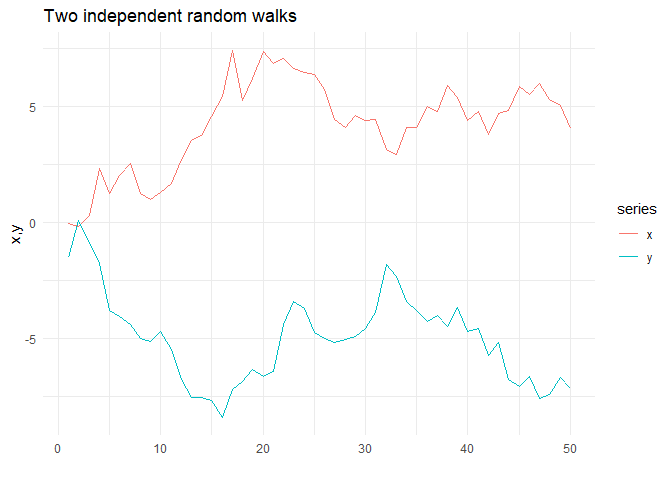
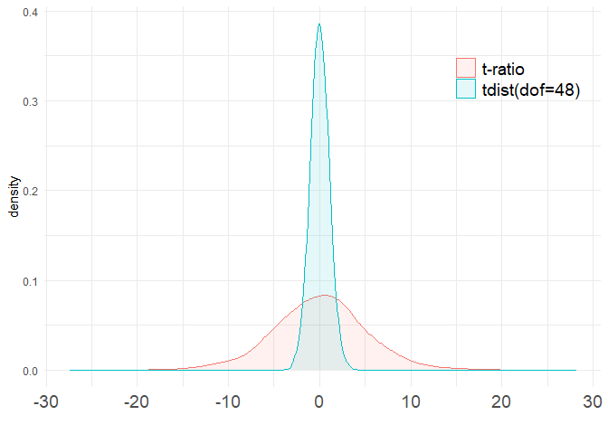
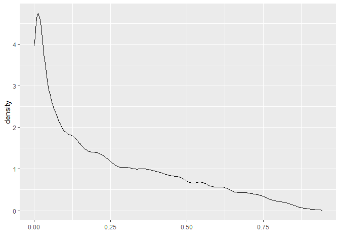
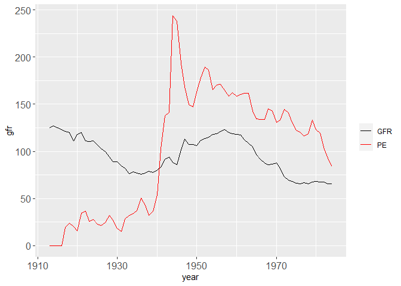
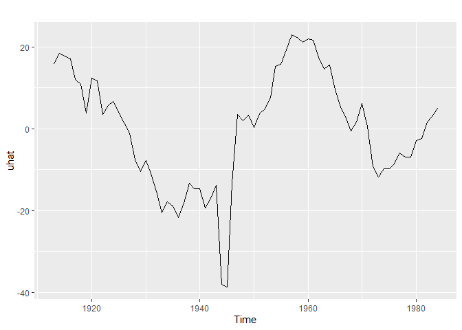
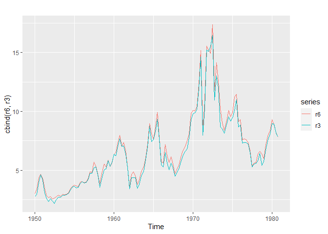
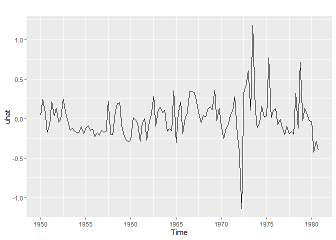
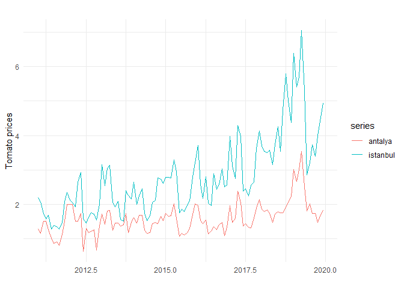
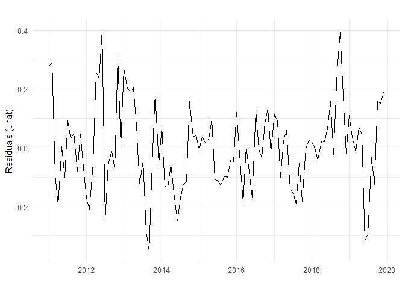

<style type="text/css"> 
body{
  font-size: 12pt;
}
code.r{
  font-size: 12pt;
}
</style>


# An Illustration of Spurious Regression 


Task: simulate two independent random walks and run a simple regression: 

```r
library(forecast)
library(ggplot2)

# simulate data 
set.seed(12)
n <- 50
e <- rnorm(n)
a <- rnorm(n)
# generate independent random walks
x <- ts(cumsum(a))
y <- ts(cumsum(e))


autoplot(cbind(x,y)) +
  theme_minimal() + xlab("") +
  ylab("x,y") + 
  ggtitle("Two independent random walks")
```

<!-- -->

Using this data set run a simple regression of y on x: 

```r
# Regression of y on x
fit1 <- lm(y ~ x)
summary(fit1)
```

```
## 
## Call:
## lm(formula = y ~ x)
## 
## Residuals:
##      Min       1Q   Median       3Q      Max 
## -2.86463 -1.31901 -0.09119  1.33612  2.90795 
## 
## Coefficients:
##             Estimate Std. Error t value Pr(>|t|)    
## (Intercept)  -2.8888     0.5619  -5.141 4.98e-06 ***
## x            -0.4984     0.1214  -4.106 0.000156 ***
## ---
## Signif. codes:  0 '***' 0.001 '**' 0.01 '*' 0.05 '.' 0.1 ' ' 1
## 
## Residual standard error: 1.663 on 48 degrees of freedom
## Multiple R-squared:  0.2599,	Adjusted R-squared:  0.2445 
## F-statistic: 16.86 on 1 and 48 DF,  p-value: 0.0001558
```

Although they are independent by construction, the OLS results above suggest that they are highly correlated with a significant t-statistic on the coefficient of x variable. 

Let's repeat this for a large number of times and obtain the sampling distributions of t ratio, its p-value, and R squared. Here is how we can extract these quantities from the R regression output: 

```r
fit1sum <- summary(fit1)
fit1sum$coef
```

```
##               Estimate Std. Error   t value     Pr(>|t|)
## (Intercept) -2.8887740  0.5619026 -5.141059 4.978031e-06
## x           -0.4983619  0.1213832 -4.105690 1.557766e-04
```

```r
# t-ratio on x
fit1sum$coef[2,3]
```

```
## [1] -4.10569
```

```r
# p-value of t-ratio on x
fit1sum$coef[2,4]
```

```
## [1] 0.0001557766
```

```r
# R-squared
fit1sum$r.squared
```

```
## [1] 0.2599067
```


```r
set.seed(12)
nreps  <- 10000          # number of replications
tratio <- rep(NA, nreps) # create vector of NAs to be filled
pvals  <- rep(NA, nreps)
Rsq    <- rep(NA, nreps)
for (i in 1:10000) { 
  n <- 50
  a <- rnorm(n)
  e <- rnorm(n) 
  x <- cumsum(a)
  y <- cumsum(e)
  regsum    <- summary(lm(y ~ x)) # regression summary
  tratio[i] <- regsum$coef[2,3]   # extract the t-ratio 
  pvals[i]  <- regsum$coef[2,4]   # extract the p-value
  Rsq[i]    <- regsum$r.squared   # extract the R-sq
}
```

Because x and y are independent by construction, we expect to reject $H_0:\beta_1 = 0$ 5% of the time for a t-test with $\alpha=0.05$. 

```r
# How often is p<0.05?
table(pvals<=0.05)/nreps
```

```
## 
##  FALSE   TRUE 
## 0.3317 0.6683
```


```r
# draw the histogram of t-ratio 
tdata <- data.frame(c(rep("t-ratio",nreps), rep("tdist(dof=48)",nreps)), 
                    c(tratio,rt(nreps,48)))
colnames(tdata) <- c("type","tratio")
```


```r
ggplot(tdata,aes(tratio, fill=type,color=type)) +
  geom_density(alpha=0.1, adjust=1.5) +   theme_minimal() + xlab("") +
  theme(legend.position = c(0.85, 0.82),
        legend.direction = "vertical",
        legend.title = element_blank(),
        legend.text = element_text(size=14),
        axis.text.x = element_text(size = 14)) 
```

<!-- -->

Now we see what the problem is. When $y$ and $x$ follow random walks, the t-statistic on the coefficient of $x$ does not follow the usual t distribution, even if random walks are statistically independent. The sampling distribution of the t-ratio from the spurious regression has extremely longer tails than the standard t distribution with 48 degrees of freedom. Hence, if we use the usual critical values from the t density to make the decision, we will reject the null more frequently. 

The quantiles of the t-ratio under spurious regression is 

```r
quantile(tratio,c(0.01,0.05,0.1,0.9,0.95,0.99))
```

```
##         1%         5%        10%        90%        95%        99% 
## -12.730306  -8.360366  -6.185379   6.324485   8.356034  12.971785
```

compare this to the standard t-distribution: 

```r
quantile(rt(nreps,48),c(0.01,0.05,0.1,0.9,0.95,0.99))
```

```
##        1%        5%       10%       90%       95%       99% 
## -2.438208 -1.723704 -1.340227  1.309324  1.693426  2.461634
```

What about R-squared? How does it behave under the spurious regression?

```r
Rsq <- data.frame(Rsq)
ggplot(Rsq,aes(Rsq)) +
  geom_density(alpha=0.1, adjust=0.5) + xlab("")  
```

<!-- -->

It looks like R-squared can be arbitrarily large even if we have independent random variables. It is not reliable as a measure of goodness-of-fit. 

# Replicating the in-class examples

## Example 18.5: Cointegration between Fertility and Personal Exemption

Are fertility rate (gfr) and tax exemptions (pe) cointegrated? 
We also add a time trend in the model. 


```r
library(wooldridge)
library(ggplot2)
ggplot(fertil3, aes(year, gfr, col="GFR")) + 
  geom_line() +
  geom_line(aes(year, pe, col="PE")) +
  scale_colour_manual(" ", values=c("GFR"="black","PE"="red")) +
  theme(axis.text.x = element_text(size = 12), 
        axis.text.y = element_text(size = 12))
```

<!-- -->

Steps in cointegration analysis:

1. Check if variables are I(1) using the ADF test 

2. If they are both I(1) run the cointegration regression and conduct the 
Engle-Granger test. 

3. If the test suggests a cointegration relationship then the model involving 
levels can be interpreted as a long run equilibrium relationship. 

4. If they are not cointegrated then we have a spurious regression. 
In that case we can estimate a dynamic (short run) model in first 
differences of variables. 

Let's follow these steps: 

**1. Apply ADF test to each variable:** 

```r
library(dynlm)
library(urca)
gfr <- ts(fertil3$gfr, start = 1913, frequency = 1)
pe <- ts(fertil3$pe, start = 1913, frequency = 1)
summary( ur.df(gfr , type = c("trend"), selectlags="AIC"))
```

```
## 
## ############################################### 
## # Augmented Dickey-Fuller Test Unit Root Test # 
## ############################################### 
## 
## Test regression trend 
## 
## 
## Call:
## lm(formula = z.diff ~ z.lag.1 + 1 + tt + z.diff.lag)
## 
## Residuals:
##     Min      1Q  Median      3Q     Max 
## -8.1650 -1.7384  0.1811  1.6733 16.8945 
## 
## Coefficients:
##             Estimate Std. Error t value Pr(>|t|)  
## (Intercept)  4.26113    3.53299   1.206    0.232  
## z.lag.1     -0.04389    0.02978  -1.474    0.145  
## tt          -0.01854    0.02825  -0.656    0.514  
## z.diff.lag   0.30930    0.11668   2.651    0.010 *
## ---
## Signif. codes:  0 '***' 0.001 '**' 0.01 '*' 0.05 '.' 0.1 ' ' 1
## 
## Residual standard error: 4.121 on 66 degrees of freedom
## Multiple R-squared:  0.112,	Adjusted R-squared:  0.07159 
## F-statistic: 2.773 on 3 and 66 DF,  p-value: 0.04824
## 
## 
## Value of test-statistic is: -1.4741 1.2581 1.0917 
## 
## Critical values for test statistics: 
##       1pct  5pct 10pct
## tau3 -4.04 -3.45 -3.15
## phi2  6.50  4.88  4.16
## phi3  8.73  6.49  5.47
```

The ADF test statistic for the variable `gfr` is $-1.47$ where we included a time trend and one lag of the dependent variable (selected by AIC). Clearly this suggests that `gfr` is nonstationary. Is the first difference stationary?


```r
dgfr <- diff(gfr)
summary( ur.df(dgfr , type = c("drift"), selectlags="AIC"))
```

```
## 
## ############################################### 
## # Augmented Dickey-Fuller Test Unit Root Test # 
## ############################################### 
## 
## Test regression drift 
## 
## 
## Call:
## lm(formula = z.diff ~ z.lag.1 + 1 + z.diff.lag)
## 
## Residuals:
##     Min      1Q  Median      3Q     Max 
## -7.9321 -2.2221 -0.1214  1.4732 16.4345 
## 
## Coefficients:
##             Estimate Std. Error t value Pr(>|t|)    
## (Intercept)  -0.7212     0.5091  -1.417    0.161    
## z.lag.1      -0.8491     0.1437  -5.907 1.34e-07 ***
## z.diff.lag    0.1953     0.1203   1.624    0.109    
## ---
## Signif. codes:  0 '***' 0.001 '**' 0.01 '*' 0.05 '.' 0.1 ' ' 1
## 
## Residual standard error: 4.103 on 66 degrees of freedom
## Multiple R-squared:  0.3799,	Adjusted R-squared:  0.3611 
## F-statistic: 20.22 on 2 and 66 DF,  p-value: 1.416e-07
## 
## 
## Value of test-statistic is: -5.9068 17.445 
## 
## Critical values for test statistics: 
##       1pct  5pct 10pct
## tau2 -3.51 -2.89 -2.58
## phi1  6.70  4.71  3.86
```

The ADF test statistic for $\Delta gfr$ is $-5.91$. Thus, we reject the null of nonstationarity. The first difference is stationary. Overall, this implies that `gfr` is I(1), i.e., it becomes stationary when we take the first difference. 

What about `pe`?

```r
summary( ur.df(pe , type = c("trend"), selectlags="AIC"))
```

```
## 
## ############################################### 
## # Augmented Dickey-Fuller Test Unit Root Test # 
## ############################################### 
## 
## Test regression trend 
## 
## 
## Call:
## lm(formula = z.diff ~ z.lag.1 + 1 + tt + z.diff.lag)
## 
## Residuals:
##     Min      1Q  Median      3Q     Max 
## -35.579  -8.172  -2.187   5.504 103.634 
## 
## Coefficients:
##             Estimate Std. Error t value Pr(>|t|)  
## (Intercept)  6.45313    4.41704   1.461   0.1488  
## z.lag.1     -0.06613    0.04495  -1.471   0.1460  
## tt           0.03167    0.14639   0.216   0.8294  
## z.diff.lag   0.25670    0.12209   2.103   0.0393 *
## ---
## Signif. codes:  0 '***' 0.001 '**' 0.01 '*' 0.05 '.' 0.1 ' ' 1
## 
## Residual standard error: 17.36 on 66 degrees of freedom
## Multiple R-squared:  0.1019,	Adjusted R-squared:  0.06103 
## F-statistic: 2.495 on 3 and 66 DF,  p-value: 0.06748
## 
## 
## Value of test-statistic is: -1.4713 1.2274 1.7496 
## 
## Critical values for test statistics: 
##       1pct  5pct 10pct
## tau3 -4.04 -3.45 -3.15
## phi2  6.50  4.88  4.16
## phi3  8.73  6.49  5.47
```

The ADF test statistic for `pe` is $-1.471$. Because it's larger than the critical value (even at 10%) we fail to reject the null. Its first difference is stationary because:

```r
dpe <- diff(pe)
summary( ur.df(dpe , type = c("drift"), selectlags="AIC"))
```

```
## 
## ############################################### 
## # Augmented Dickey-Fuller Test Unit Root Test # 
## ############################################### 
## 
## Test regression drift 
## 
## 
## Call:
## lm(formula = z.diff ~ z.lag.1 + 1 + z.diff.lag)
## 
## Residuals:
##     Min      1Q  Median      3Q     Max 
## -35.954  -6.853  -1.684   4.238 103.798 
## 
## Coefficients:
##             Estimate Std. Error t value Pr(>|t|)    
## (Intercept)  1.00503    2.14695   0.468    0.641    
## z.lag.1     -0.83368    0.15266  -5.461 7.72e-07 ***
## z.diff.lag   0.08688    0.12312   0.706    0.483    
## ---
## Signif. codes:  0 '***' 0.001 '**' 0.01 '*' 0.05 '.' 0.1 ' ' 1
## 
## Residual standard error: 17.74 on 66 degrees of freedom
## Multiple R-squared:  0.3869,	Adjusted R-squared:  0.3683 
## F-statistic: 20.82 on 2 and 66 DF,  p-value: 9.755e-08
## 
## 
## Value of test-statistic is: -5.4609 14.914 
## 
## Critical values for test statistics: 
##       1pct  5pct 10pct
## tau2 -3.51 -2.89 -2.58
## phi1  6.70  4.71  3.86
```

Therefore `pe` is also I(1). 

Because we have two I(1) variables the regression of `gfr` on `pe` may result in spurious regression. To check that we need to run the cointegration test. 

**2. Apply the Engle-Granger Cointegration Test:** 


```r
# run the test regression 
fert1 <- dynlm(gfr ~ trend(gfr) + pe)
summary(fert1)
```

```
## 
## Time series regression with "ts" data:
## Start = 1913, End = 1984
## 
## Call:
## dynlm(formula = gfr ~ trend(gfr) + pe)
## 
## Residuals:
##     Min      1Q  Median      3Q     Max 
## -38.659  -9.934   1.841  11.027  22.882 
## 
## Coefficients:
##              Estimate Std. Error t value Pr(>|t|)    
## (Intercept) 109.93016    3.47526  31.632  < 2e-16 ***
## trend(gfr)   -0.90519    0.10899  -8.305 5.53e-12 ***
## pe            0.18666    0.03463   5.391 9.23e-07 ***
## ---
## Signif. codes:  0 '***' 0.001 '**' 0.01 '*' 0.05 '.' 0.1 ' ' 1
## 
## Residual standard error: 14.2 on 69 degrees of freedom
## Multiple R-squared:  0.5002,	Adjusted R-squared:  0.4857 
## F-statistic: 34.53 on 2 and 69 DF,  p-value: 4.064e-11
```

```r
uhat <- residuals(fert1)
autoplot(uhat)
```

<!-- -->

The Engle-Granger test is simply the ADF test statistic on the residuals from the regression in levels. 


```r
# Compute Engle-Granger test
summary( ur.df(uhat , type = c("drift"), selectlags="AIC"))
```

```
## 
## ############################################### 
## # Augmented Dickey-Fuller Test Unit Root Test # 
## ############################################### 
## 
## Test regression drift 
## 
## 
## Call:
## lm(formula = z.diff ~ z.lag.1 + 1 + z.diff.lag)
## 
## Residuals:
##      Min       1Q   Median       3Q      Max 
## -26.3691  -2.0676   0.5353   2.1575  21.0876 
## 
## Coefficients:
##             Estimate Std. Error t value Pr(>|t|)  
## (Intercept) -0.18304    0.67143  -0.273    0.786  
## z.lag.1     -0.11867    0.04894  -2.425    0.018 *
## z.diff.lag   0.24498    0.11696   2.095    0.040 *
## ---
## Signif. codes:  0 '***' 0.001 '**' 0.01 '*' 0.05 '.' 0.1 ' ' 1
## 
## Residual standard error: 5.614 on 67 degrees of freedom
## Multiple R-squared:  0.1145,	Adjusted R-squared:  0.08807 
## F-statistic: 4.332 on 2 and 67 DF,  p-value: 0.01701
## 
## 
## Value of test-statistic is: -2.4248 2.9675 
## 
## Critical values for test statistics: 
##       1pct  5pct 10pct
## tau2 -3.51 -2.89 -2.58
## phi1  6.70  4.71  3.86
```

Denoting the residuals by $\hat{u}_t$, regression results can be written in equation form as follows 
$$
\widehat{\Delta \hat{u}}_t = -0.18 -0.12 \hat{u}_{t-1} + 0.24 \Delta \hat{u}_{t-1}
$$
Thus, the Engle-Granger cointegration test statistic is 
$$
EG = \frac{-0.12}{0.05}=-2.43
$$
From Table 18.5 we see that the 10% critical value is $-3.50$. Because EG is larger than the critical value we **fail to reject** the null hypothesis. **There is no cointegration**. 

The fact that there is no long run relationship between gfr and pe suggests that the levels regression suffers from the spurious regression problem. Thus, we may consider running an FDL model in first differences. (we did this in ch. 11). 


## Example: Are 3-month and 6-month interest rates cointegrated?


```r
library(wooldridge)
r6 <- ts(intqrt$r6, start = 1950, frequency = 4)
r3 <- ts(intqrt$r3, start = 1950, frequency = 4)
spr <- r6-r3
autoplot(cbind(r6, r3))  
```

<!-- -->

Static regression: 

```r
intreg1 <- dynlm(r6 ~ r3)
summary(intreg1)
```

```
## 
## Time series regression with "ts" data:
## Start = 1950(1), End = 1980(4)
## 
## Call:
## dynlm(formula = r6 ~ r3)
## 
## Residuals:
##     Min      1Q  Median      3Q     Max 
## -1.1379 -0.1583 -0.0251  0.1155  1.1803 
## 
## Coefficients:
##             Estimate Std. Error t value Pr(>|t|)    
## (Intercept) 0.135374   0.054867   2.467    0.015 *  
## r3          1.025899   0.007709 133.081   <2e-16 ***
## ---
## Signif. codes:  0 '***' 0.001 '**' 0.01 '*' 0.05 '.' 0.1 ' ' 1
## 
## Residual standard error: 0.2584 on 122 degrees of freedom
## Multiple R-squared:  0.9932,	Adjusted R-squared:  0.9931 
## F-statistic: 1.771e+04 on 1 and 122 DF,  p-value: < 2.2e-16
```


```r
# Residuals from the static regression
uhat <- residuals(intreg1)
autoplot(uhat)
```

<!-- -->


```r
summary( ur.df(uhat , type = c("drift"), selectlags="AIC"))
```

```
## 
## ############################################### 
## # Augmented Dickey-Fuller Test Unit Root Test # 
## ############################################### 
## 
## Test regression drift 
## 
## 
## Call:
## lm(formula = z.diff ~ z.lag.1 + 1 + z.diff.lag)
## 
## Residuals:
##      Min       1Q   Median       3Q      Max 
## -1.01607 -0.13502 -0.03502  0.09798  1.07234 
## 
## Coefficients:
##             Estimate Std. Error t value Pr(>|t|)    
## (Intercept) -0.00385    0.02257  -0.171    0.865    
## z.lag.1     -0.63207    0.11208  -5.639 1.17e-07 ***
## z.diff.lag  -0.14605    0.09148  -1.597    0.113    
## ---
## Signif. codes:  0 '***' 0.001 '**' 0.01 '*' 0.05 '.' 0.1 ' ' 1
## 
## Residual standard error: 0.2492 on 119 degrees of freedom
## Multiple R-squared:  0.3814,	Adjusted R-squared:  0.371 
## F-statistic: 36.69 on 2 and 119 DF,  p-value: 3.867e-13
## 
## 
## Value of test-statistic is: -5.6392 15.9425 
## 
## Critical values for test statistics: 
##       1pct  5pct 10pct
## tau2 -3.46 -2.88 -2.57
## phi1  6.52  4.63  3.81
```

# Application: Tomato Prices in Antalya and Istanbul


```r
load("../Data/tomatoprices.RData")
antalya <- ts(tomatoprices$antalya, start = 2011, frequency = 12)
istanbul <- ts(tomatoprices$istanbul, start = 2011, frequency = 12)
# plot of the series
library(forecast)
library(ggplot2)
autoplot(cbind(antalya, istanbul)) +
  theme_minimal() + xlab("") + ylab("Tomato prices")  
```

<!-- -->

```r
  # theme(axis.text.x = element_text(size = 14), 
  #      axis.text.y = element_text(size = 14))
```
 

Assume that both prices are I(1). Run the regression of log(istanbul) on 
log(antalya) together with a time trend.


```r
listanbul <- log(istanbul)
lantalya <- log(antalya)

res1 <- dynlm(listanbul ~ trend(listanbul) + lantalya)
summary(res1)
```

```
## 
## Time series regression with "ts" data:
## Start = 2011(1), End = 2019(12)
## 
## Call:
## dynlm(formula = listanbul ~ trend(listanbul) + lantalya)
## 
## Residuals:
##      Min       1Q   Median       3Q      Max 
## -0.35182 -0.10085 -0.00436  0.08620  0.39871 
## 
## Coefficients:
##                  Estimate Std. Error t value Pr(>|t|)    
## (Intercept)      0.303658   0.031171   9.742 2.33e-16 ***
## trend(listanbul) 0.070355   0.006603  10.656  < 2e-16 ***
## lantalya         0.787020   0.062464  12.600  < 2e-16 ***
## ---
## Signif. codes:  0 '***' 0.001 '**' 0.01 '*' 0.05 '.' 0.1 ' ' 1
## 
## Residual standard error: 0.1513 on 105 degrees of freedom
## Multiple R-squared:  0.8457,	Adjusted R-squared:  0.8427 
## F-statistic: 287.6 on 2 and 105 DF,  p-value: < 2.2e-16
```

```r
uhat <- residuals(res1)
autoplot(uhat) + xlab("") + ylab("Residuals (uhat)")+theme_minimal()
```

<!-- -->


```r
summary( ur.df(uhat , type = c("drift"), selectlags="AIC"))
```

```
## 
## ############################################### 
## # Augmented Dickey-Fuller Test Unit Root Test # 
## ############################################### 
## 
## Test regression drift 
## 
## 
## Call:
## lm(formula = z.diff ~ z.lag.1 + 1 + z.diff.lag)
## 
## Residuals:
##      Min       1Q   Median       3Q      Max 
## -0.39538 -0.08916  0.00043  0.08206  0.33896 
## 
## Coefficients:
##              Estimate Std. Error t value Pr(>|t|)    
## (Intercept) -0.003684   0.013250  -0.278    0.782    
## z.lag.1     -0.617421   0.107302  -5.754 9.02e-08 ***
## z.diff.lag  -0.010648   0.096932  -0.110    0.913    
## ---
## Signif. codes:  0 '***' 0.001 '**' 0.01 '*' 0.05 '.' 0.1 ' ' 1
## 
## Residual standard error: 0.1363 on 103 degrees of freedom
## Multiple R-squared:  0.3175,	Adjusted R-squared:  0.3042 
## F-statistic: 23.96 on 2 and 103 DF,  p-value: 2.861e-09
## 
## 
## Value of test-statistic is: -5.7541 16.5597 
## 
## Critical values for test statistics: 
##       1pct  5pct 10pct
## tau2 -3.46 -2.88 -2.57
## phi1  6.52  4.63  3.81
```
The EG test statistic is $-5.75$ which needs to be compared to the appropriate critical values (see the classnotes). Do not use the usual ADF critical values. 

Result suggests that Antalya and Istanbul prices are cointegrated. The short-run relationship may be modelled using an error correction model (ECM) such as: 

```r
# an ECM 
ecm1 <- dynlm(d(listanbul) ~ L(uhat) + L(d(listanbul)) +  L(d(lantalya)))
summary(ecm1)
```

```
## 
## Time series regression with "ts" data:
## Start = 2011(3), End = 2019(12)
## 
## Call:
## dynlm(formula = d(listanbul) ~ L(uhat) + L(d(listanbul)) + L(d(lantalya)))
## 
## Residuals:
##      Min       1Q   Median       3Q      Max 
## -0.58409 -0.11028 -0.00235  0.13245  0.48589 
## 
## Coefficients:
##                  Estimate Std. Error t value Pr(>|t|)   
## (Intercept)      0.006686   0.019969   0.335  0.73846   
## L(uhat)         -0.448506   0.161971  -2.769  0.00668 **
## L(d(listanbul)) -0.124305   0.147249  -0.844  0.40054   
## L(d(lantalya))   0.166888   0.135678   1.230  0.22151   
## ---
## Signif. codes:  0 '***' 0.001 '**' 0.01 '*' 0.05 '.' 0.1 ' ' 1
## 
## Residual standard error: 0.2052 on 102 degrees of freedom
## Multiple R-squared:  0.1467,	Adjusted R-squared:  0.1216 
## F-statistic: 5.843 on 3 and 102 DF,  p-value: 0.001006
```
or excluding the lagged differenced prices: 

```r
# an ECM 
ecm2 <- dynlm(d(listanbul) ~ L(uhat))
summary(ecm2)
```

```
## 
## Time series regression with "ts" data:
## Start = 2011(2), End = 2019(12)
## 
## Call:
## dynlm(formula = d(listanbul) ~ L(uhat))
## 
## Residuals:
##      Min       1Q   Median       3Q      Max 
## -0.60131 -0.11113 -0.00407  0.12943  0.44963 
## 
## Coefficients:
##              Estimate Std. Error t value Pr(>|t|)    
## (Intercept)  0.006686   0.019715   0.339 0.735193    
## L(uhat)     -0.532334   0.132546  -4.016 0.000111 ***
## ---
## Signif. codes:  0 '***' 0.001 '**' 0.01 '*' 0.05 '.' 0.1 ' ' 1
## 
## Residual standard error: 0.2039 on 105 degrees of freedom
## Multiple R-squared:  0.1332,	Adjusted R-squared:  0.1249 
## F-statistic: 16.13 on 1 and 105 DF,  p-value: 0.0001113
```


<br>
<div class="tocify-extend-page" data-unique="tocify-extend-page" style="height: 0;"></div>

 
