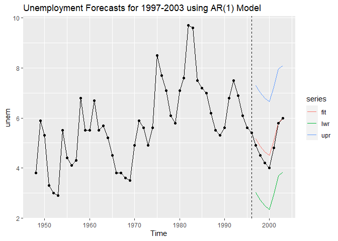
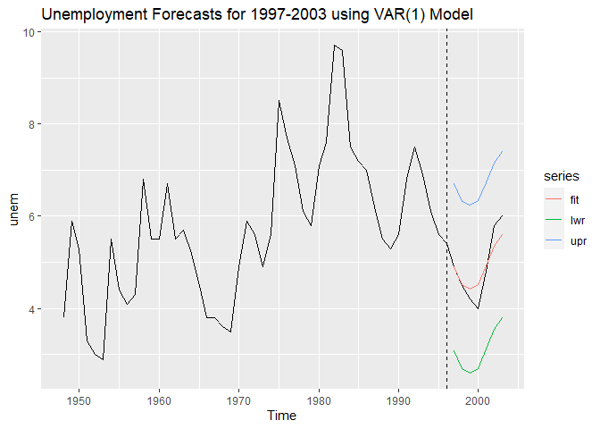
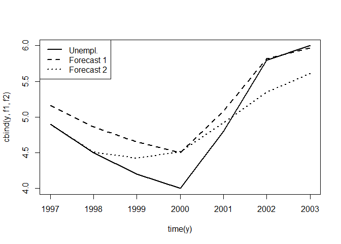
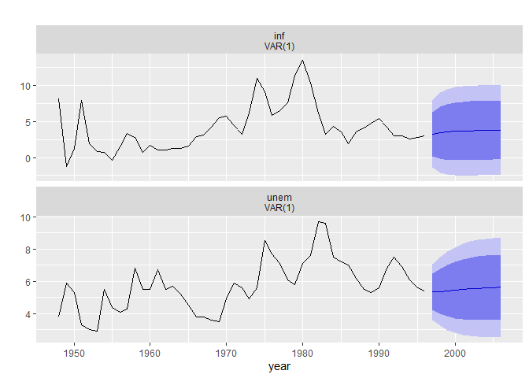

<style type="text/css"> 
body{
  font-size: 12pt;
}
code.r{
  font-size: 12pt;
}
</style>


# Basics of Forecasting  

## Example: Forecasting Unemployment 


Load packages, data set, and plot 3-month treasury bill rates: 

```r
library(dynlm) 
library(stargazer)
library(forecast)
library(ggplot2)
library(wooldridge)
# define time series
tsdat=ts(phillips, start=1948)

# Estimate AR(1)
res1 <- dynlm(unem ~ L(unem)      , data=tsdat, end=1996)
# AR(1) + lagged inflation
# practically this is the first equation of a VAR(1) system
res2 <- dynlm(unem ~ L(unem) + L(inf), data=tsdat, end=1996)
stargazer(res1, res2 ,type="text", keep.stat=c("n","adj.rsq","ser"))
```

```
## 
## ===================================================
##                           Dependent variable:      
##                     -------------------------------
##                                  unem              
##                           (1)             (2)      
## ---------------------------------------------------
## L(unem)                0.732***        0.647***    
##                         (0.097)         (0.084)    
##                                                    
## L(inf)                                 0.184***    
##                                         (0.041)    
##                                                    
## Constant               1.572***         1.304**    
##                         (0.577)         (0.490)    
##                                                    
## ---------------------------------------------------
## Observations              48              48       
## Adjusted R2              0.544           0.677     
## Residual Std. Error 1.049 (df = 46) 0.883 (df = 45)
## ===================================================
## Note:                   *p<0.1; **p<0.05; ***p<0.01
```

Form the predictions and standard errors:  

```r
# AR(1) Predictions for 1997-2003 including 95% forecast intervals:
p1 <- predict(res1, newdata=window(tsdat,start=1997), interval="prediction")
p1
```

```
##        fit      lwr      upr
## 1 5.160275 3.021340 7.299210
## 2 4.867333 2.720958 7.013709
## 3 4.647627 2.493832 6.801422
## 4 4.501157 2.341549 6.660764
## 5 5.087040 2.946509 7.227571
## 6 5.819394 3.686837 7.951950
## 7 5.965864 3.832765 8.098963
```


```r
# VAR(1) Predictions for 1997-2003 including 95% forecast intervals:
p2 <- predict(res2, newdata=window(tsdat,start=1997), interval="prediction")
p2
```

```
##        fit      lwr      upr
## 1 4.896451 3.090266 6.702636
## 2 4.509137 2.693393 6.324881
## 3 4.425175 2.607626 6.242724
## 4 4.516062 2.696384 6.335740
## 5 4.923537 3.118433 6.728641
## 6 5.350271 3.540939 7.159603
## 7 5.608180 3.803599 7.412761
```

Plot the forecast from the AR(1) model

```r
unem <- ts(phillips$unem, start=1948)
AR1fit <- ts(p1, start=1997)
autoplot(unem) + autolayer(AR1fit) +geom_point(aes(y=unem)) + 
  geom_vline(xintercept = 1996, linetype=2) +
  ggtitle("Unemployment Forecasts for 1997-2003 using AR(1) Model")
```

<!-- -->

Plot the forecast from the VAR(1) model

```r
VAR1fit <- ts(p2, start=1997)
autoplot(unem) + 
  autolayer(VAR1fit) + 
  geom_vline(xintercept = 1996, linetype=2) +
  ggtitle("Unemployment Forecasts for 1997-2003 using VAR(1) Model")
```

<!-- -->

Compute the out-of-sample forecasts and forecast errors:  

```r
# Actual unemployment and forecasts:
y  <- window(tsdat,start=1997)[,"unem"]
f1 <- predict( res1, newdata=window(tsdat,start=1997) )
f2 <- predict( res2, newdata=window(tsdat,start=1997) )

# Plot unemployment and forecasts:
matplot(time(y), cbind(y,f1,f2), type="l",  col="black",lwd=2,lty=1:3)
legend("topleft",c("Unempl.","Forecast 1","Forecast 2"),lwd=2,lty=1:3)
```

<!-- -->


```r
# Forecast errors:
e1<- y - f1
e2<- y - f2
```


```r
# RMSE:
sqrt(mean(e1^2))
```

```
## [1] 0.3247281
```

```r
sqrt(mean(e2^2))
```

```
## [1] 0.3135421
```


```r
# MAE:
mean(abs(e1))
```

```
## [1] 0.2738516
```

```r
mean(abs(e2))
```

```
## [1] 0.2455728
```

The second model, VAR(1), a has smaller RMSE and MAE. 

# Fitting a VAR model

We can use `vars` package to estimate a VAR. 
For example, using the `phillips` data set: 

```r
library(fpp2)
library(vars)
tsdat <- ts(phillips, start=1948, end=1996)
var1 <- VAR(tsdat[,c("unem","inf")], p=1, type="const")
summary(var1)
```

```
## 
## VAR Estimation Results:
## ========================= 
## Endogenous variables: unem, inf 
## Deterministic variables: const 
## Sample size: 48 
## Log Likelihood: -167.172 
## Roots of the characteristic polynomial:
## 0.7556 0.5502
## Call:
## VAR(y = tsdat[, c("unem", "inf")], p = 1, type = "const")
## 
## 
## Estimation results for equation unem: 
## ===================================== 
## unem = unem.l1 + inf.l1 + const 
## 
##         Estimate Std. Error t value Pr(>|t|)    
## unem.l1  0.64703    0.08381   7.721 8.82e-10 ***
## inf.l1   0.18358    0.04118   4.458 5.46e-05 ***
## const    1.30380    0.48969   2.663   0.0107 *  
## ---
## Signif. codes:  0 '***' 0.001 '**' 0.01 '*' 0.05 '.' 0.1 ' ' 1
## 
## 
## Residual standard error: 0.883 on 45 degrees of freedom
## Multiple R-Squared: 0.6906,	Adjusted R-squared: 0.6768 
## F-statistic: 50.22 on 2 and 45 DF,  p-value: 3.443e-12 
## 
## 
## Estimation results for equation inf: 
## ==================================== 
## inf = unem.l1 + inf.l1 + const 
## 
##         Estimate Std. Error t value Pr(>|t|)    
## unem.l1  0.05727    0.22593   0.253    0.801    
## inf.l1   0.65883    0.11102   5.934 3.91e-07 ***
## const    0.97404    1.32011   0.738    0.464    
## ---
## Signif. codes:  0 '***' 0.001 '**' 0.01 '*' 0.05 '.' 0.1 ' ' 1
## 
## 
## Residual standard error: 2.38 on 45 degrees of freedom
## Multiple R-Squared: 0.4575,	Adjusted R-squared: 0.4334 
## F-statistic: 18.97 on 2 and 45 DF,  p-value: 1.058e-06 
## 
## 
## 
## Covariance matrix of residuals:
##         unem     inf
## unem  0.7797 -0.5343
## inf  -0.5343  5.6662
## 
## Correlation matrix of residuals:
##         unem     inf
## unem  1.0000 -0.2542
## inf  -0.2542  1.0000
```

Compute and plot forecasts: 


```r
forecast(var1) %>% 
  autoplot() +
  xlab("year")
```

<!-- -->


The Granger-causality test from inflation to unemployment

```r
causality(var1, cause = "inf")
```

```
## $Granger
## 
## 	Granger causality H0: inf do not Granger-cause unem
## 
## data:  VAR object var1
## F-Test = 19.87, df1 = 1, df2 = 90, p-value = 2.382e-05
## 
## 
## $Instant
## 
## 	H0: No instantaneous causality between: inf and unem
## 
## data:  VAR object var1
## Chi-squared = 2.9137, df = 1, p-value = 0.08783
```

The F statistic is 19.87 with a very small p-value. Thus, we reject the null hypothesis. **Inflation Granger-causes unemployment**. This implies that inflation is useful in forecasting one-period-ahead unemployment rate. 

The Granger-causality test from unemployment to inflation: 

```r
causality(var1, cause = "unem")
```

```
## $Granger
## 
## 	Granger causality H0: unem do not Granger-cause inf
## 
## data:  VAR object var1
## F-Test = 0.064249, df1 = 1, df2 = 90, p-value = 0.8005
## 
## 
## $Instant
## 
## 	H0: No instantaneous causality between: unem and inf
## 
## data:  VAR object var1
## Chi-squared = 2.9137, df = 1, p-value = 0.08783
```

The F test statistic is 0.06 with pvalue = 0.80, thus we don't reject the null hypothesis. **Unemployment does not Granger-cause inflation**. 

Overall, we can say that while inflation is useful in predicting the future unemployment rate the reverse is not true. Unemployment is not useful in predicting future inflation. 

<br>
<div class="tocify-extend-page" data-unique="tocify-extend-page" style="height: 0;"></div>

 
