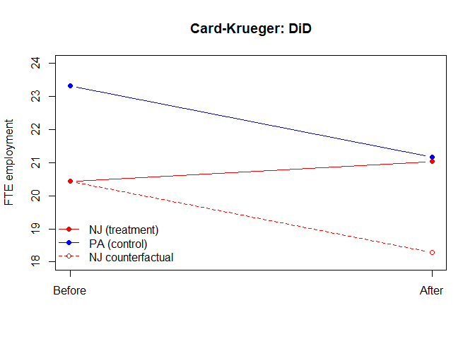

<style type="text/css"> 
body{
  background-color: #FAFAFA;
  font-size: 18px;
  line-height: 1.8;
}
code.r{
  font-size: 12pt;
}
</style>
<br>


In this lab we use the `wooldridge` package (which ships the textbook data sets) and
the `plm` package for panel-data estimation. Install them once if needed:


```r
install.packages(c("wooldridge", "plm", "lmtest", "sandwich", "stargazer"))
```


```r
library(wooldridge)
library(plm)
library(lmtest)
library(sandwich)
library(stargazer)
```

# Part I: Panel Data

## Pooled OLS, Fixed Effects, and Random Effects

We use the `wagepan` data set: a balanced panel of 545 men observed over
1980--1987 (`nr` = person id, `year` = time). The outcome is the log hourly
wage (`lwage`).


```r
data("wagepan")
# declare the panel structure: individual index = nr, time index = year
pdat <- pdata.frame(wagepan, index = c("nr", "year"))
pdim(pdat)
```

```
## Balanced Panel: n = 545, T = 8, N = 4360
```

We estimate the effect of being in a union (`union`) and being married
(`married`) on log wages, controlling for year effects.

**Pooled OLS** ignores the panel structure (treats every observation as
independent):


```r
pooled <- plm(lwage ~ married + union + factor(year),
              data = pdat, model = "pooling")
```

**Random effects (RE)** assumes the unobserved effect $a_i$ is uncorrelated
with the regressors:


```r
re <- plm(lwage ~ married + union + factor(year),
          data = pdat, model = "random")
```

**Fixed effects (FE, within)** allows $a_i$ to be correlated with the
regressors by demeaning within each person:


```r
fe <- plm(lwage ~ married + union + factor(year),
          data = pdat, model = "within")
```

Compare the three estimators side by side:


```r
stargazer(pooled, re, fe, type = "text",
          column.labels = c("Pooled", "RE", "FE"),
          keep = c("married", "union"),
          keep.stat = c("n", "rsq"))
```

```
## 
## ==========================================
##                   Dependent variable:     
##              -----------------------------
##                          lwage            
##               Pooled      RE        FE    
##                 (1)       (2)       (3)   
## ------------------------------------------
## married      0.142***  0.080***  0.058*** 
##               (0.016)   (0.017)   (0.018) 
##                                           
## union        0.176***  0.105***  0.083*** 
##               (0.018)   (0.018)   (0.019) 
##                                           
## ------------------------------------------
## Observations   4,360     4,360     4,360  
## R2             0.113     0.155     0.169  
## ==========================================
## Note:          *p<0.1; **p<0.05; ***p<0.01
```

The union and marriage premia shrink as we move from pooled OLS to FE. Part of
the cross-sectional "premium" reflects time-invariant characteristics of the
men (e.g. ability, stable job attachment) that FE differences away.

## Time-invariant regressors drop out under FE

Education (`educ`) does not change over the sample for these men. If we add it
to the FE model it is perfectly absorbed by the individual effect $a_i$ and
cannot be estimated:


```r
fe2 <- plm(lwage ~ educ + married + union + factor(year),
           data = pdat, model = "within")
coef(fe2)["educ"]   # NA: educ is time-invariant and is differenced away
```

```
## <NA> 
##   NA
```

## Hausman test: FE vs RE

The Hausman test compares the FE and RE estimates. Under $H_0$ the unobserved
effect is uncorrelated with the regressors (RE is consistent and efficient);
under $H_1$ only FE is consistent.


```r
phtest(fe, re)
```

```
## 
## 	Hausman Test
## 
## data:  lwage ~ married + union + factor(year)
## chisq = 18.286, df = 9, p-value = 0.032
## alternative hypothesis: one model is inconsistent
```

A small p-value rejects $H_0$, favoring the **fixed effects** estimator: the
unobserved individual effect is correlated with union/marriage status.

## Clustered standard errors

Idiosyncratic errors are typically serially correlated within a person, so we
cluster standard errors at the individual level:


```r
coeftest(fe, vcov = vcovHC(fe, type = "sss", cluster = "group"))
```

```
## 
## t test of coefficients:
## 
##                  Estimate Std. Error t value  Pr(>|t|)    
## married          0.058337   0.021335  2.7343 0.0062793 ** 
## union            0.083370   0.023058  3.6157 0.0003034 ***
## factor(year)1981 0.113549   0.024616  4.6128 4.104e-06 ***
## factor(year)1982 0.167669   0.024272  6.9078 5.744e-12 ***
## factor(year)1983 0.210939   0.024958  8.4517 < 2.2e-16 ***
## factor(year)1984 0.278407   0.027669 10.0620 < 2.2e-16 ***
## factor(year)1985 0.327462   0.027044 12.1084 < 2.2e-16 ***
## factor(year)1986 0.386807   0.028296 13.6702 < 2.2e-16 ***
## factor(year)1987 0.447037   0.027378 16.3283 < 2.2e-16 ***
## ---
## Signif. codes:  0 '***' 0.001 '**' 0.01 '*' 0.05 '.' 0.1 ' ' 1
```

## Two-period first differencing

With only two periods, the fixed-effects estimator is identical to first
differencing. We replicate Wooldridge's Example 13.9 using `crime2`: a panel of
46 cities observed in 1982 and 1987. The data set already stores the changes
(`ccrmrte` = $\Delta$ crime rate, `cunem` = $\Delta$ unemployment) on the 1987
rows. Regressing the change in the crime rate on the change in unemployment
removes any time-constant city characteristics:


```r
data("crime2")
fd <- lm(ccrmrte ~ cunem, data = subset(crime2, year == 87))
summary(fd)
```

```
## 
## Call:
## lm(formula = ccrmrte ~ cunem, data = subset(crime2, year == 87))
## 
## Residuals:
##     Min      1Q  Median      3Q     Max 
## -36.912 -13.369  -5.507  12.446  52.915 
## 
## Coefficients:
##             Estimate Std. Error t value Pr(>|t|)   
## (Intercept)  15.4022     4.7021   3.276  0.00206 **
## cunem         2.2180     0.8779   2.527  0.01519 * 
## ---
## Signif. codes:  0 '***' 0.001 '**' 0.01 '*' 0.05 '.' 0.1 ' ' 1
## 
## Residual standard error: 20.05 on 44 degrees of freedom
## Multiple R-squared:  0.1267,	Adjusted R-squared:  0.1069 
## F-statistic: 6.384 on 1 and 44 DF,  p-value: 0.01519
```

Compare this with a (naive) pooled regression of the crime rate on
unemployment, which ignores city heterogeneity and even gets the sign "wrong":


```r
pooled_crime <- lm(crmrte ~ unem, data = crime2)
coef(summary(pooled_crime))
```

```
##                Estimate Std. Error    t value     Pr(>|t|)
## (Intercept) 103.2433994  8.0587367 12.8113628 5.361812e-22
## unem         -0.3076641  0.9317223 -0.3302101 7.420087e-01
```

Once we difference out the fixed city effects, higher unemployment is
associated with a higher crime rate.

# Part II: Causal Inference & Difference-in-Differences

## Difference-in-Differences: the incinerator example

We replicate Wooldridge's Example 13.3 (`kielmc`): did the rumor/construction
of a garbage incinerator in North Andover, MA lower nearby housing prices?
We have repeated cross sections of house sales in **1978** (before) and **1981**
(after).

* Treatment group: houses **near** the incinerator site (`nearinc = 1`).
* Control group: houses farther away (`nearinc = 0`).
* `y81 = 1` for the after period (1981).


```r
data("kielmc")
# group-by-period mean real prices: the 2x2 table
aggregate(rprice ~ y81 + nearinc, data = kielmc, FUN = mean)
```

```
##   y81 nearinc    rprice
## 1   0       0  82517.23
## 2   1       0 101307.51
## 3   0       1  63692.86
## 4   1       1  70619.24
```

The DiD estimate is the coefficient on the **interaction** `y81:nearinc`:


```r
did <- lm(rprice ~ nearinc + y81 + y81:nearinc, data = kielmc)
summary(did)
```

```
## 
## Call:
## lm(formula = rprice ~ nearinc + y81 + y81:nearinc, data = kielmc)
## 
## Residuals:
##    Min     1Q Median     3Q    Max 
## -60678 -17693  -3031  12483 236307 
## 
## Coefficients:
##             Estimate Std. Error t value Pr(>|t|)    
## (Intercept)    82517       2727  30.260  < 2e-16 ***
## nearinc       -18824       4875  -3.861 0.000137 ***
## y81            18790       4050   4.640 5.12e-06 ***
## nearinc:y81   -11864       7457  -1.591 0.112595    
## ---
## Signif. codes:  0 '***' 0.001 '**' 0.01 '*' 0.05 '.' 0.1 ' ' 1
## 
## Residual standard error: 30240 on 317 degrees of freedom
## Multiple R-squared:  0.1739,	Adjusted R-squared:  0.1661 
## F-statistic: 22.25 on 3 and 317 DF,  p-value: 4.224e-13
```

The interaction coefficient is the causal effect of being near the incinerator
on the house price. Adding controls (so parallel trends needs to hold only
conditionally) sharpens the estimate:


```r
did_ctrl <- lm(log(rprice) ~ nearinc + y81 + y81:nearinc +
                 age + I(age^2) + log(intst) + log(land) + log(area) +
                 rooms + baths, data = kielmc)
coeftest(did_ctrl)["nearinc:y81", ]
```

```
##    Estimate  Std. Error     t value    Pr(>|t|) 
## -0.13151382  0.05197130 -2.53050829  0.01188439
```

With controls, houses near the incinerator fell roughly 13% in value relative
to the control group after 1981.

## Card and Krueger (1994): minimum wage and employment

The original Card--Krueger micro data are not in the `wooldridge` package, but
the famous result is just a $2\times 2$ difference-in-differences. We reproduce
it from the published group--period averages of full-time-equivalent (FTE)
employment (Card and Krueger, 1994, Table 3):


```r
ck <- data.frame(
  state  = c("PA", "PA", "NJ", "NJ"),
  period = c("before", "after", "before", "after"),
  fte    = c(23.33, 21.17, 20.44, 21.03)
)
ck
```

```
##   state period   fte
## 1    PA before 23.33
## 2    PA  after 21.17
## 3    NJ before 20.44
## 4    NJ  after 21.03
```

Compute the two changes over time and the difference-in-differences:


```r
d_PA <- ck$fte[ck$state=="PA" & ck$period=="after"] -
        ck$fte[ck$state=="PA" & ck$period=="before"]
d_NJ <- ck$fte[ck$state=="NJ" & ck$period=="after"] -
        ck$fte[ck$state=="NJ" & ck$period=="before"]

d_PA          # change in control group (PA)
d_NJ          # change in treatment group (NJ)
d_NJ - d_PA   # difference-in-differences estimate
```

```
## [1] -2.16
## [1] 0.59
## [1] 2.75
```

The DiD estimate is about **+2.75 FTE workers**: despite the minimum-wage
increase in New Jersey, employment did not fall (it rose slightly relative to
Pennsylvania) -- the result that helped launch the modern "credibility
revolution" in empirical economics.

## A visual check of parallel trends

Plotting the group means makes the logic transparent. The DiD effect is the
gap between New Jersey's observed point and its counterfactual (the Pennsylvania
trend applied to New Jersey):


```r
t <- c(0, 1)                                   # 0 = before, 1 = after
PA <- c(23.33, 21.17)                          # control
NJ <- c(20.44, 21.03)                          # treatment (observed)
NJ_cf <- c(20.44, 20.44 + (PA[2]-PA[1]))       # counterfactual (parallel to PA)

plot(t, NJ, type="b", pch=19, col="red", ylim=c(18,24),
     xaxt="n", xlab="", ylab="FTE employment",
     main="Card-Krueger: DiD")
axis(1, at=t, labels=c("Before", "After"))
lines(t, PA, type="b", pch=19, col="blue")
lines(t, NJ_cf, type="b", pch=1, lty=2, col="red")
legend("bottomleft", bty="n",
       legend=c("NJ (treatment)", "PA (control)", "NJ counterfactual"),
       col=c("red","blue","red"), pch=c(19,19,1), lty=c(1,1,2))
```

<!-- -->

## Exercises

1. In the `wagepan` example, add `exper` and `expersq` to the FE model. Why does
   `exper` cause a problem once year dummies are included?
2. Re-estimate the `kielmc` DiD using `log(rprice)` instead of `rprice`. How does
   the interpretation of the interaction coefficient change?
3. Using `crime2`, look at `?crime2` and add another differenced control (a
   variable starting with `c`, e.g. the change in police per capita) to the
   first-differenced model. Does the change in unemployment remain significant?
4. For the Card--Krueger numbers, set up a small "long" data frame with a
   treatment dummy, a post dummy, and their interaction, and recover the DiD
   estimate from an OLS regression.


